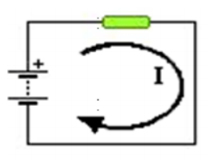
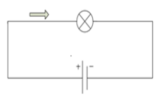
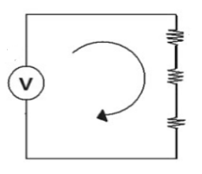

# :trophy: C1.2 Reto en clase #

**Conceptos de electrónica básica y simulacion de circuitos**
___
### :blue_book: Instrucciones

- De acuerdo con la información presentada por el asesor referente al tema electrónica básica, contestar las preguntas indicadas dentro del apartado desarrollo 
- Diseñar los circuitos mostrados dentro de la herramienta ***tinkercad***.
- Analice los tres siguientes circuitos y responder a lo que se pregunta en cada uno de ellos, **explicando** como se obtuvo el resultado y una vez realizado los cálculos teóricos, utilice el simulador propuesto y diseñe los circuitos realizando la simulación y demostración de los resultados obtenidos.
___
### :pencil2: Desarrollo

**Circuitos electronicos**

1. Un circuito que tiene una pila de 6 voltios genera una corriente que atraviesa una resistencia eléctrica de 2 ohmios. Cual es el valor de la intensidad de la corriente que pasa por la resistencia?

    

+  Registre sus cálculos obtenidos y los simulados 

    Elemento | Valor teórico | Valor simulación
    ---------|----------|---|
    Intensidad | 3 amperes  | 3 amperes|
    

    > #####  Explicacion #####
    > Con ayuda de la teoria vista en clase se opto por usar 4 baterias de 1.5V puestas en serie para poder obtener el voltaje necesario, debido a que no conocia las diferentes fuentes de alimentacion que proporciona Tinkercad.
    > > Datos | valor | 
    > >----- | ---- |
    > > Tension | 6 volts |
    > > Resistencia | 2 ohms |
    > > Intensidad | ?? |
    >
    > Con el uso de la ley de Ohmn se llego al resultado. **I = V / R**
    > 
    > **I = 6 volts / 2 ohms = 3 amperes**
    >   

+ Coloque aquí las imágenes de evidencia de la simulación.
  ##### Simulacion realizada en tinkercad #####

    

___

1. Encuentre la tensión de la pila que necesitas para que pase una corriente cuya intensidad es de 3 amperes por una bombilla que tiene 2 ohmios de resistencia.

    

+ Registre sus cálculos obtenidos y los simulados: 

    Elemento | Valor teórico | Valor simulación
    ---------|----------|---|
    Voltaje |6 volts  | 6 volts |

+ Coloque aquí las imágenes de evidencia de la simulación.

    

___

1. Encuentre la corriente eléctrica total y el voltaje en cada resistencia que se encuentra dentro del circuito, considerando los siguientes valores resistivos,

    

  + Registre sus cálculos obtenidos y los simulados: 
    Elemento | Valor teórico | Valor simulación
    ---------|----------|---|
    R1 | 80 ohms | 80 ohms |
    R2 | 120 ohms | 120 ohms |
    R3 | 12 ohms | 12 ohms |
    VT | 60 volts | 60 volts|
    VR1 | 22.6415 volts| 22.5 volts |
    VR2 | 33.9622 volts| 33.8 volts |
    VR3 | 3.3962 volts| 3.38 volts |
    IT | 0.2830 amperes | 282 mA (0.282 ampere)|

    >   **Formula para calcular voltaje en una resistencia**
    > > *VRn = VoltajeTotal * ( Resistencia / ResistenciaTotal).*
    >
    > **Calculos**
    >
    >  VR1 = 60V( 80 ohms / 212 ohms ) = 22.6415v
    >
    >  VR2 = 60V( 120 ohms / 212 ohms ) = 33.9622v 
    >
    >  VR3 = 60V( 12 ohms / 212 ohms) = 3.3962v
    >
    > **Formula para calcular IT**
    > > *IT = VT/RT*
    >
    > IT = 60 volts / 212ohms = 0.28301875 amperes.
  + Coloque aquí las imágenes de evidencia de la simulación.
  ##### Simulacion realizada en tinkercad #####
+ ###### Voltaje ######

    

  
+ ###### Resistencia ######

    

+ ###### Amperaje total ######

    

___

### :bomb: Rubrica

| Criterios     | Descripción                                                                                  | Puntaje |
| ------------- | -------------------------------------------------------------------------------------------- | ------- |
| Instrucciones | Se cumple con cada uno de los puntos indicados dentro del apartado Instrucciones?            | 20 |
| Desarrollo    | Se respondió a cada uno de los puntos solicitados dentro del desarrollo de la actividad?     | 80   |

:house: [Ir a inicio](https://github.com/CarlosNavaR/SistemasProgramables)