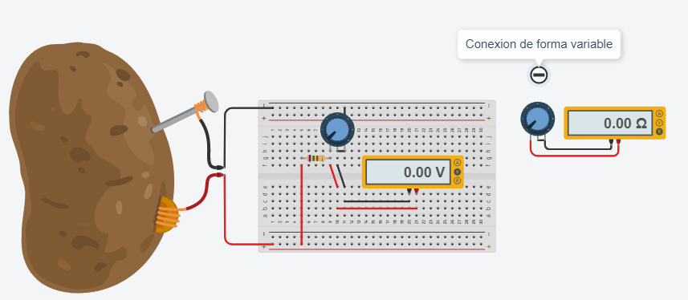
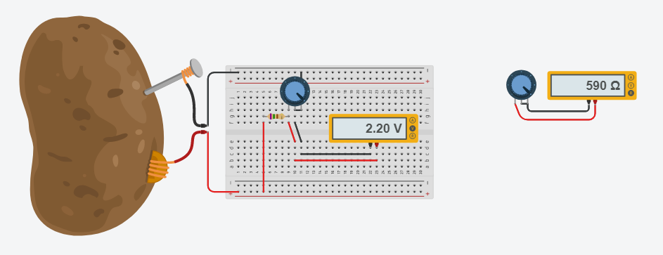

# :trophy: C1.3 Reto en clase #

**Circuito electrónico para uso con sensores y transductores, y simulación**
___
### :blue_book: Instrucciones

- De acuerdo con la información presentada por el asesor referente al tema sensores y transductores,
contestar las preguntas indicadas dentro del apartado desarrollo,
- Diseñar los circuitos mostrados dentro de la herramienta tinkercad..
  
___
### :pencil2: Desarrollo

1. Cual es la diferencia entre un sensor y un transductor?
    
   > La principal diferencia que se encuentra es que el sensor siempre se encuentra en contacto con la magnitud del medio que lo condiciona y si la magnitud varia tambien sufre cambio la propiedad del sensor, mientras que el transductor toma una variable fisica y la transforma en otra que facilite su medida. 
   
2. Cuales son los elementos importantes de un sensor?
     
    > Sensor (área sensible), transductor (circuito de procesamiento) y acondicionador de señal (salida de señales)
   
3. Que nombre recibe un elemento electrónico en el cual su valor de resistencia es dependiente de la
cantidad de luz al que esta expuesto?
     
    > Fotoresistencia (sensor LDR)
4. Calcular el valor de voltaje en Vout dado que R1=750 ohm, R2=100 ohm y Vin= 3.3v
     
    > Vout = (100 ohm * 3.3 v) / (750 ohm + 100 ohm)  
    Vout = **0.388235 v**

    

5. Diseñe y simule el circuito anterior utilizando la herramienta tinker cad, y reemplace R2 por un potenciómetro. 

    

1. Que valores de impedancia se debería tener en R2 para que el rango de valor en Vout sea entre 0 a 3.3V, si Vin es de 5v y R1=750 ohms? Explique los cálculos realizados para obtener ese valor.
     
    > Para poder obtener el valor de R2 se tomo como base la formula:  
    vout = (R2 * Vin) / (R1 + R2)  
    Despejando la formula anterior se llego a la siguiente formula:  
    >> R2 = (Vout * R1) / (Vin - Vout) 

    > Procedimientos:  
    R2(0v) = (0v * 750ohms) / (5v - 0v) = 0  
    R2(1.5v) = (1.5v * 750ohms) / (5v - 1.5v) = 321.45 ohms  
    R2(2.2v) = (2.2v * 750ohms) / (5v - 2.2v) = 589.285 ohms  
    R2(3.3v) = (3.3v * 750ohms) / (5v - 3.3v) = 1455.885 ohms  

    | vout | R2 |
    | --  | -- |
    0 v   | 0 ohms
    1.5 v | 321.428 ohms
    2.2 v | 589.285 ohms
    3.3 v | 1455.882 ohms

2. Coloque aquí evidencias de la simulación realizada.

> para poder comprobar los resultados en tinkercad, en la primera simulacion se tiene que colocar el multimetro de forma variable, ya que de lo contrario toma el valor total del potenciometro, solo aplica para asignarle 0 ohms.

 

**0 volts - 0 ohms**

    

**1.5 volts - 321.428 ohms**

    

**2.2 volts - 589.285 ohms**

    

**3.3 volts - 1455.882 ohms**

    

___

### :bomb: Rubrica

| Criterios     | Descripción                                                                                  | Puntaje |
| ------------- | -------------------------------------------------------------------------------------------- | ------- |
| Instrucciones | Se cumple con cada uno de los puntos indicados dentro del apartado Instrucciones?            | 20 |
| Desarrollo    | Se respondió a cada uno de los puntos solicitados dentro del desarrollo de la actividad?     | 80   |

:house: [Ir a inicio](https://github.com/CarlosNavaR/SistemasProgramables)