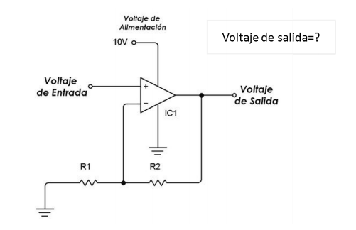
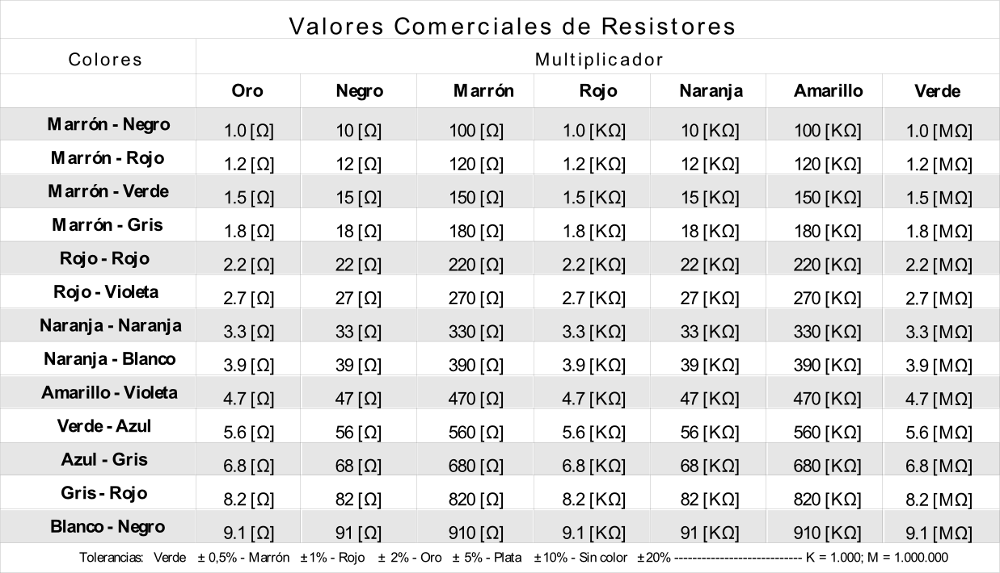
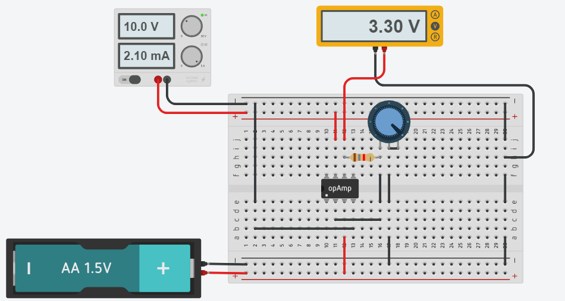
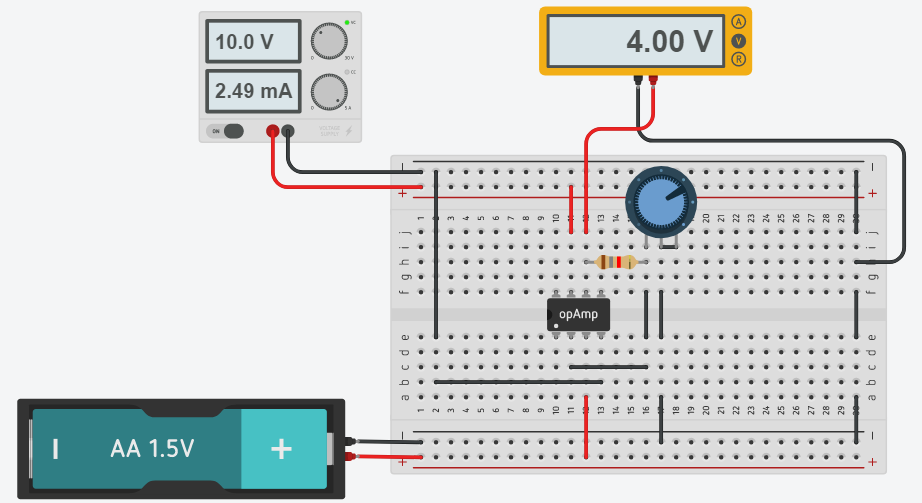
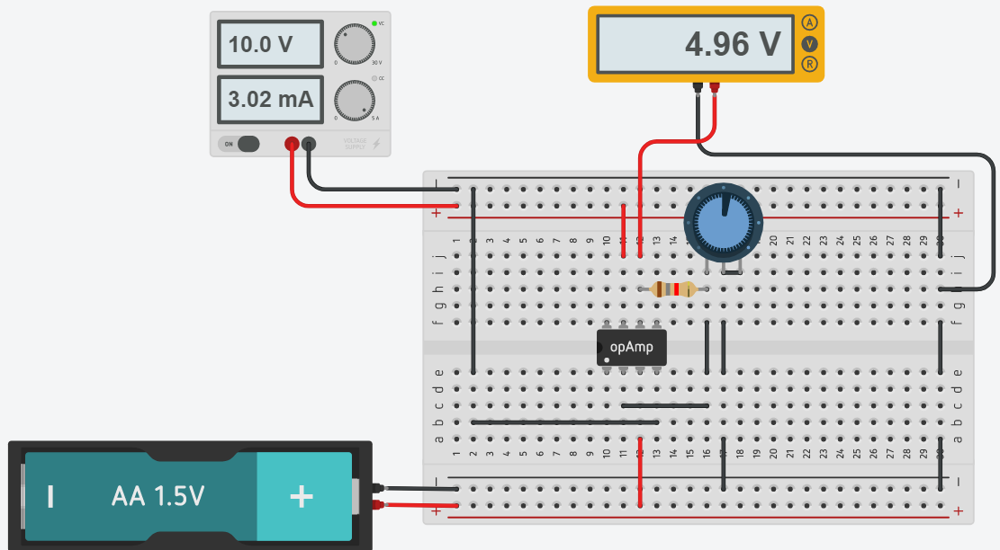

# :trophy: C1.4 Reto en clase #

**Circuito electrónico para el acondicionamiento de señal con un amplificador operacional y simulación.**
___
### :blue_book: Instrucciones

- De acuerdo con la información presentada por el asesor referente al tema acondicionadores de señal, contestar lo que se indica dentro del apartado desarrollo.
- Simule el circuito mostrado utilizando la herramienta tinkercad para ello.
___

### :pencil2: Desarrollo

1. Calcule el valor de R1 y R2 que se requiere, para obtener una voltaje de salida de 3.3v, dado que el Voltaje de entrada es de 1.5v? Explique el procedimiento utilizado para realizar el calculo y considere valores comerciales para las resistencias que se considere utilizar.

    

> **Formulas base**  
*R2 = VSalida - Ventrada*  
*R1 = Ventrada - 0*  

   

**Procedimiento**  
R2 = 3.3v - 1.5v = 1.8 	kΩ;  
R1 = 1.5V - 0 = 1.5 kΩ;  

   

**Comprobación**  
Vsalida = 1.5v * (1 + (1.8 kΩ/1.5 kΩ))  
Vsalida = 1.5v * (2.2)  
Vsalida = 3.3v

    

2. Diseñe y simule el circuito utilizando la herramienta Tinkercad.

   

     
    

3. Cambie el valor de R1 o R2 por un potenciómetro de tal forma que pueda compensar una salida de voltaje tal como se muestra en la tabla siguiente:
   | vo   | Resistencia | R2      |
   | ---- | ----------- | ------- |
   | ~ 1v | --          | 1.8 kΩ |
   | ~ 2v | --          | 1.8 kΩ |
   | ~ 3v | 1.5 kΩ     | 1.8 kΩ |
   | ~ 4v | 1.08 kΩ    | 1.8 kΩ |
   | ~ 5v | 780 Ω      | 1.8 kΩ |

4. Coloque aqui evidencias de la simulación.

 > ~ 1v  
No se puede obtener un valor de salida menor al valor de entrada

 > ~ 2v  
 Al tener un valor resistivo de 1.5kΩ el minimo voltaje que podemos obtener es 3.3v, si deseamos tener un voltaje menor tendriamos que ajustar el valor resistivo a 5.40kΩ que nos generaria un voltaje de salida de 2v

 > ~ 3v  

    

 > ~ 4v  

    

 > ~ 5v  

    

---
### :bomb: Rubrica

| Criterios     | Descripción                                                                              | Puntaje |
| ------------- | ---------------------------------------------------------------------------------------- | ------- |
| Instrucciones | Se cumple con cada uno de los puntos indicados dentro del apartado Instrucciones?        | 20      |
| Desarrollo    | Se respondió a cada uno de los puntos solicitados dentro del desarrollo de la actividad? | 80      |

:house: [Ir a inicio](https://github.com/CarlosNavaR/SistemasProgramables)