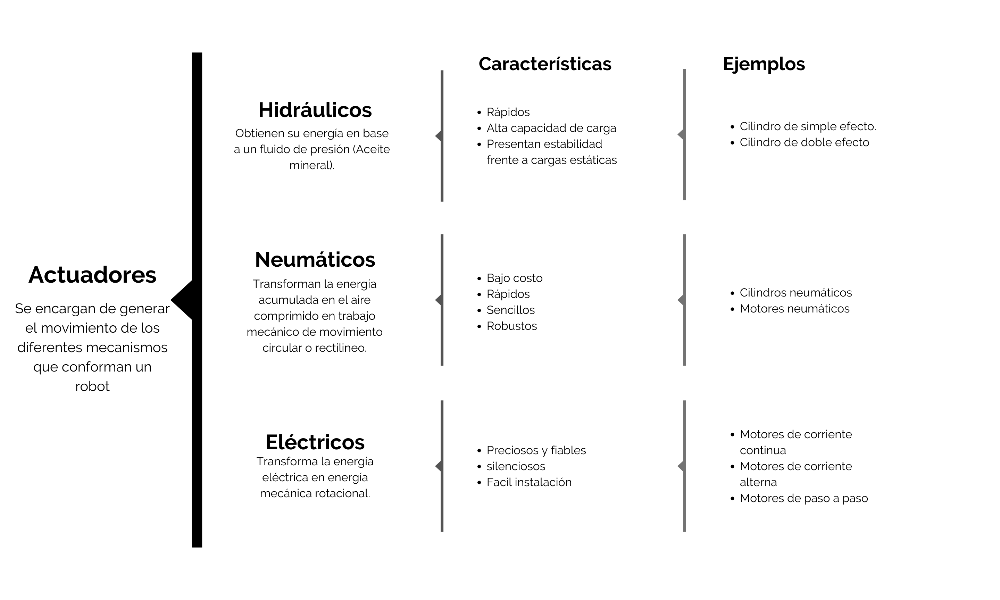
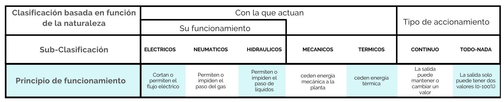
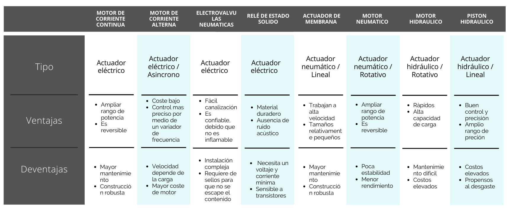

## :trophy: C2.1 Reto en clase
---

**Actuadores Neumatico e Hidraulicos, y sus tipos**

---

### :blue_book: Instrucciones

- De acuerdo con la información presentada por el asesor referente al tema actuadores y a los videos observados sobre el mismo tema, elabore lo que se solicita dentro del apartado desarrollo.
---

### :pencil2: Desarrollo

Listado de preguntas:

1. Basándose en el video [actuadores en Robótica](https://www.youtube.com/watch?v=e_6rjEGWqoY), realice un cuadro sinóptico sobre la clasificación de los actuadores.

 

2. De acuerdo con el video [descripcion de los actuadores industriales](https://www.youtube.com/watch?v=mFsPxpFHajM) realice una matriz comparativa indicando clasificacion, subclasificacion, principio de funcionamiento, ventajas y desventajas.

 
 

3. De acuerdo con el video [Neumática Industrial](https://www.youtube.com/watch?v=Wee85cI6wwQ&t=394s), explique como trabaja un sistema Neumático?
    > Los sistemas neumáticos trabajan con 5 tipos de componentes que son muy comunes en los sistemas, tiene como objetivo principal crear movimiento que realizara algún tipo de trabajo en un entorno industrial:  
    Comprensor, genera la energía que alimenta el sistema en forma de aire comprimido, para generar este aire toma el aire de su entorno y lo confina en un espacio más pequeño para crear la energía necesaria.  
    Unidad de preparación de aire (FRL), el cual cuenta con un filtro, regulador y un lubricador que son piezas que componen la unidad de preparación de aire.  
    Separador de líquido, es la primera unidad, el cual hace girar el aire utilizando paletas especiales, con ayuda de la rápida circulación hace que elimine la debido a la fuerza centrífuga.  
    Filtro, el cual elimina más las partículas y humedad en un proceso de dos etapas con ayuda de paletas o aspas por el cual circula aire en la primera etapa y en la segunda etapa el aire pasa a través de una media filtrante llamada elemento con el fin de atrapar los contaminantes no deseados.  
    Una vez que este seco y limpio es común ajustar el nivel de aire que sale del comprensor, el cual tiene un impacto en cuanto a fuerza, una presión mas alta permite al actuador ejercer mas fuerza y una presión mas baja genera menos fuerza, el regulador logra esto con ayuda de un ensamble accionado por resorte y la perilla ajusta la fuerza del resorte del control, para lograr un punto de ajuste de presión deseada.  
    Cada vez que el nivel de presión disminuye por debajo del punto de ajusto deseado la válvula abre un camino para que la presión mas alta fluye hasta que se regule.  
    Por último, cuenta con un lubricador para distribuir una fina de aire comprimido en el aire para lubricar los componentes.  
    Válvula de control direccional, cuenta con guías internas para conectar el aire que llega al puerto de entrada, direccionando por medio de diferentes puertos con ayuda de un carrete.  
    Controlador (PLC) controlará la válvula y sus canales para redirigir el aire por medio de una señal eléctrica y decidir porque sección saldrá el aire.  
    Actuador, convertirán el aire comprimido en un movimiento para poder realizar una acción, donde el aire será capaz de mover el pistón hasta que alcance su límite físico.  
    El PLC controlara el funcionamiento de todo el proceso.

---
### :bomb: Rubrica

| Criterios     | Descripción                                                                              | Puntaje |
| ------------- | ---------------------------------------------------------------------------------------- | ------- |
| Instrucciones | Se cumple con cada uno de los puntos indicados dentro del apartado Instrucciones?        | 20      |
| Desarrollo    | Se respondió a cada uno de los puntos solicitados dentro del desarrollo de la actividad? | 80      |

:house: [Ir a inicio](https://github.com/CarlosNavaR/SistemasProgramables)