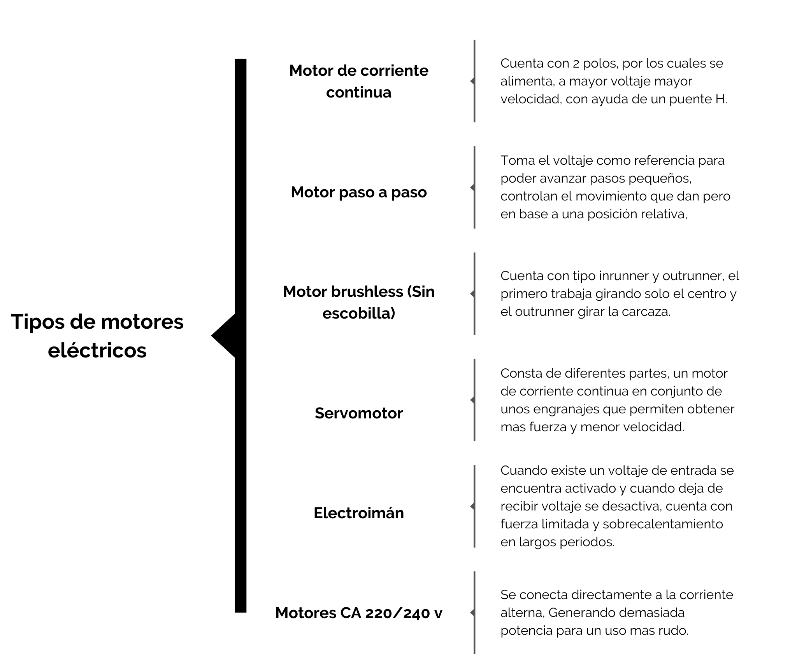

## :trophy: C2.2 Actuadores eléctricos

---

**Actuadores eléctricos y sus tipos**

---

### :blue_book: Instrucciones

- De acuerdo con la información presentada por el asesor referente al tema actuadores y a los videos observados sobre el mismo tema, elabore lo que se solicita dentro del apartado desarrollo.

---

## :pencil2: Desarrollo

Listado de preguntas:

1. Basado en el video [tipos de motores eléctricos](https://www.youtube.com/watch?v=pgr4yRMnB_A) elabore un cuadro sinoptico indicando su clasificación, y principio de funcionamiento.

     

2. De acuerdo con el video [instalación básica de neumática y arduino](https://www.youtube.com/watch?v=DdvLAXfuNpY&t=8s), cual es el propósito del microcontrolador para este sistema? Que otros componentes electrónicos observa en el video?

    > El propósito de usar un microcontrolador en este sistema es suministrar el voltaje a una tira de relé y controlar el comportamiento que este tiene para determinar cuándo debe activar una señal para accionar el cilindro de doble efecto.

    **Componentes**

    - Electrovalvulas
    - Arduino  
    - Tira de relé  
    - Cilindro de doble efecto  
    - Servomotor  
    - Pulsador

3. Basandose en el video [Como funciona la impresora 3D](https://www.youtube.com/watch?v=C4HAJ5HLuB4), que tipo de sensores y actuadores están integrados, y con que proposito es utilizado dentro de este sistema de impresión? 

    -	Sensor de presencia
    -	Sensor de proximidad
    -	Sensor de temperatura
    -	Motor de corriente eléctrica
    -	Motor paso a paso 

    > **Sensor de presencia** el propósito de este sensor es detectar si existe algún elemento activo para continuar suministrando filamento.  
    **Sensor de proximidad** el propósito de este sensor es detectar la distancia entre el dispensador de filamento y el objeto para obtener una mayor precisión.  
    **Sensor de temperatura** el propósito de este sensor es medir la temperatura para evitar sobrecalentamiento y activar la velocidad del ventilador para disipar de una mejor manera.  
    **Motor de corriente continua** el propósito de este motor es controlar el desplazamiento en el eje horizontal con ayuda del puente “H” que permite controlar la dirección y velocidad.  
    **Motor paso a paso** el propósito de este motor es desplazar el dispensador debido a que este motor es muy preciso y se puede aumentar o disminuir su velocidad de una manera muy estable.

---

### :bomb: Rubrica

| Criterios     | Descripción                                                                                  | Puntaje |
| ------------- | -------------------------------------------------------------------------------------------- | ------- |
| Instrucciones | Se cumple con cada uno de los puntos indicados dentro del apartado Instrucciones?            | 20 |
| Desarrollo    | Se respondió a cada uno de los puntos solicitados dentro del desarrollo de la actividad?     | 80      |

:house: [Ir a inicio](https://github.com/CarlosNavaR/SistemasProgramables)