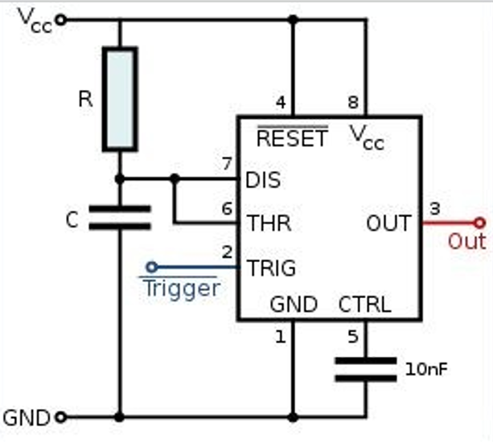

# Actuadores

---

## :trophy: C2.3 Reto en clase

**Circuito temporizador con circuito NE555**

---

### :blue_book: Instrucciones

- De acuerdo con la información presentada por el asesor referente al tema, elabore lo que se solicita dentro del apartado desarrollo.

---
## :pencil2: Desarrollo

1. Investigue que es la modulación por ancho de pulso y para que sirve.
    > La modulación por ancho de pulso o PWM (Pulse Width Modulation) se usa para controlar el ancho de una señal digital con el propósito de controlar a su vez la potencia que se entrega a ciertos dispositivos.  
    Tiene una forma de onda cuadrada la cual no siempre tiene la misma relación entre el tiempo que esta en alto(ON-TON) y el tiempo que esta bajo(OFF-TOFF).

2. Calcule el valor de C y R para obtener un valor de señal de 5 segundos para el siguiente circuito temporizador mono-estable.
    > Formula: Ct = 1.1 * R * C   
      Despejes:  
      R = Ct / (1.1*C)  
      C = Ct / (1.1*R)  
      Como solo se contaba con un valor lo cual hacia complicado obtener los valores, opte por asignar un valor de 1 ohm de resistencia para asi poder calcular el capacitor.  
      C = 5 seg / (1.1*1 ohm) = 4.545 nf  
      Como no existe un valor comercial de ese tamaño le asigne un valor de 4
      7 nf.

    |Valor R | Valor C  |
    ---------|----------|
    |1 ohm   | 4.7 nf   |

3. Como se podrá observar la imagen anexa corresponde a un circuito temporizador,que terminal se tendría que utilizar para activar el temporizador? Cual terminal se utilizaría si se desea integrar un actuador eléctrico?

  

    

---
### :bomb: Rubrica

| Criterios     | Descripción                                                                              | Puntaje |
| ------------- | ---------------------------------------------------------------------------------------- | ------- |
| Instrucciones | Se cumple con cada uno de los puntos indicados dentro del apartado Instrucciones?        | 20      |
| Desarrollo    | Se respondió a cada uno de los puntos solicitados dentro del desarrollo de la actividad? | 80      |

:house: [Ir a inicio](https://github.com/CarlosNavaR/SistemasProgramables)