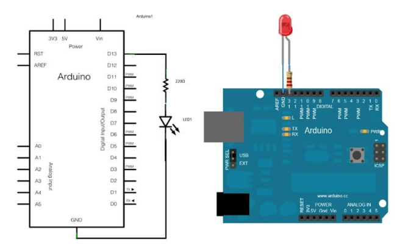
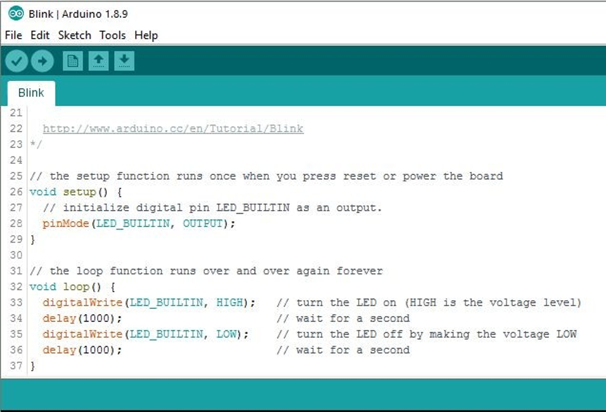

## :trophy: C3.1 Arduino UNO salida digital
---

Arduino IDE y Arduino UNO, utilizando un diodo LED y una resistencia

---
### :blue_book: Instrucciones

- De acuerdo con la información presentada por el asesor referente al tema, desarrollar lo que se indica dentro del apartado desarrollo.
- 
---
## :pencil2: Desarrollo

1. Basado en el siguiente circuito, y utilizando uno de los simuladores propuestos, ensamblar lo que observa.

    

2. Analice y escriba el programa que se muestra a continuación.

    

3. Explique el resultado observado.
    > Con ayuda de arduino se establece que el comportamiento del LED tendra un retraso de un segundo alternando el encendido y apagado mediante la sentencia digitalWrite lo que ocasiona que se declare en modo alto o bajo la alimentacion, lo que quiere decir que se mande una señal de voltaje o no. 
4. Inserte aquí las imágenes que considere como evidencias para demostrar el resultado obtenido.
   

    
    

---

### :bomb: Rubrica

| Criterios     | Descripción                                                                                  | Puntaje |
| ------------- | -------------------------------------------------------------------------------------------- | ------- |
| Instrucciones | Se cumple con cada uno de los puntos indicados dentro del apartado Instrucciones?            | 20 |
| Desarrollo    | Se respondió a cada uno de los puntos solicitados dentro del desarrollo de la actividad?     | 80      |

:house: [Ir a inicio](https://github.com/CarlosNavaR/SistemasProgramables)