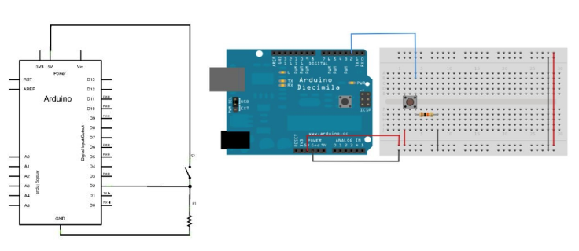
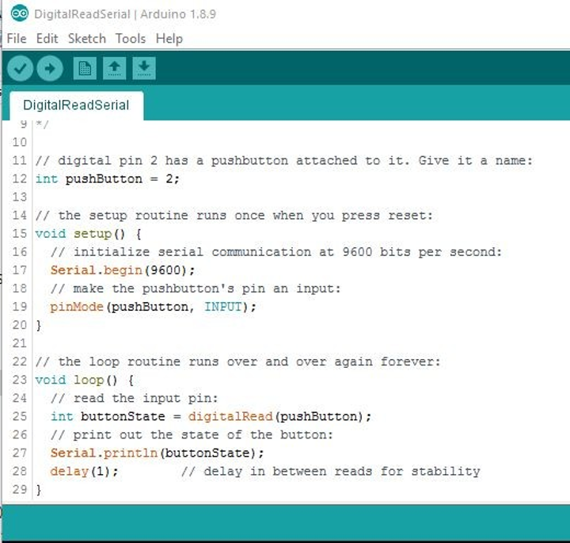

# Programación Microcontrolador Arduino
---

## :trophy: C3.2 Entradas digital

Arduino y entrada digital, utilizando un push button y una resistencia.
---
## :blue_book: Instrucciones

- De acuerdo con la información presentada por el asesor referente al tema, desarrollar lo que se indica dentro del apartado siguiente.
---
## :pencil2: Desarrollo

1. Basado en el siguiente circuito, y utilizando uno de los simuladores propuestos, ensamblar lo que observa.

    

2. Analice y escriba el programa que se muestra a continuación.

    

3. Inserte imágenes que considere como evidencias para demostrar el resultado obtenido.
 
    > El codigo nos ayuda a conocer el estado del pin 2 que se establece en modo de entrada lo cual permite recibir una señal, como se muestra en la siguiente imagen esta una grafica que muestra el comportamiento del circuito, cada que se presiona el boton deja pasar x cantidad de voltaje el cual al dejar de pulsar el boton no manda directo a cero sino que va disminuyendo lentamente, como se muestra en la grafica existe la variacion en que se mantiene en alto(1) y bajo(0), siempre y cuando exista una minima cantidad de voltaje el pin detectara una señal 1. 

    

---

### :bomb: Rubrica

| Criterios     | Descripción                                                                                  | Puntaje |
| ------------- | -------------------------------------------------------------------------------------------- | ------- |
| Instrucciones | Se cumple con cada uno de los puntos indicados dentro del apartado Instrucciones?            | 20 |
| Desarrollo    | Se respondió a cada uno de los puntos solicitados dentro del desarrollo de la actividad?     | 80      |

:house: [Ir a inicio](https://github.com/CarlosNavaR/SistemasProgramables)