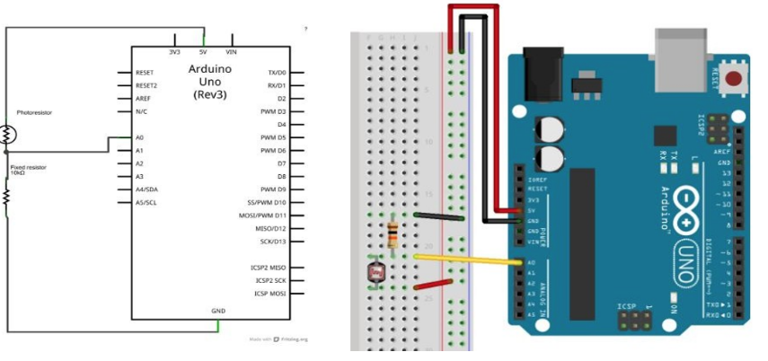
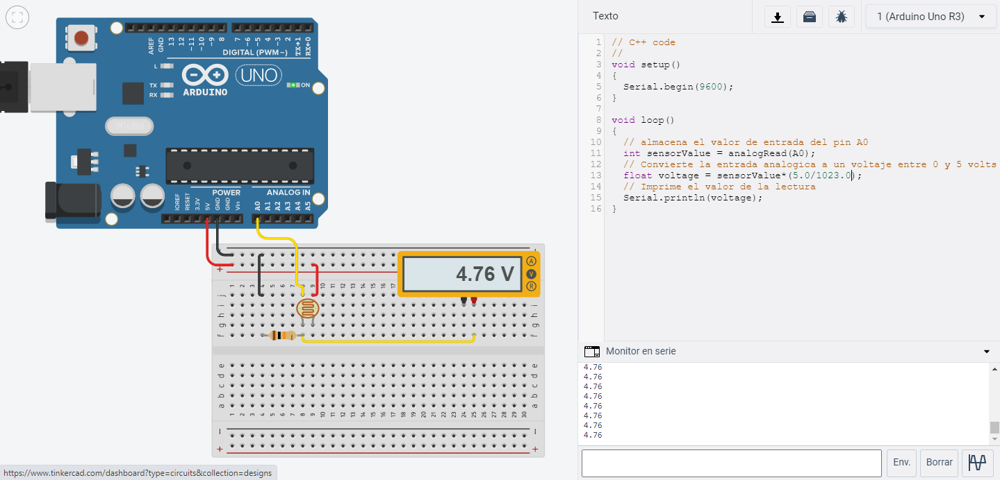

# Programación Microcontrolador Arduino

## :trophy: C3.3 Entradas Análoga

Arduino y entrada análoga, utilizando una resistencia y un sensor LDR

---

## :blue_book: Instrucciones

- De acuerdo con la información presentada por el asesor referente al tema, desarrollar lo que se indica dentro del apartado siguiente.

---

## :pencil2: Desarrollo

1. Basado en el siguiente circuito, y utilizando uno de los simuladores propuestos, ensamblar lo que observa.

    

2. Analice y escriba el programa que se muestra a continuación.

    

3. Inserte aquí las imágenes que considere como evidencias para demostrar el resultado obtenido.

> Para demostrar que el voltaje que se mostraba en el monitor en serie fuese correcto, hice uso de un multimetro el cual permite ver el comportamiento del voltaje, gracias al LDR el voltaje que se proporciona es equivalente a las condiciones de luz ambiental, entre mayor luz ambiental mayor es el voltaje que se proporciona a la entrada analoga.

 

    

---

### :bomb: Rubrica

| Criterios     | Descripción                                                                                  | Puntaje |
| ------------- | -------------------------------------------------------------------------------------------- | ------- |
| Instrucciones | Se cumple con cada uno de los puntos indicados dentro del apartado Instrucciones?            | 20 |
| Desarrollo    | Se respondió a cada uno de los puntos solicitados dentro del desarrollo de la actividad?     | 80      |

:house: [Ir a inicio](https://github.com/CarlosNavaR/SistemasProgramables)