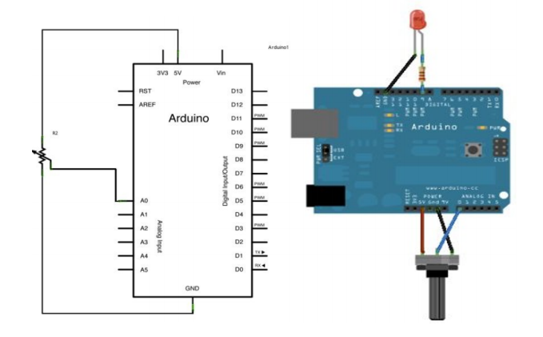
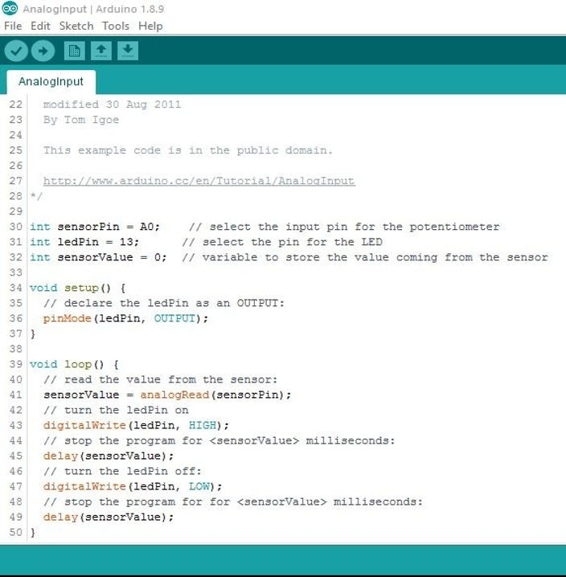
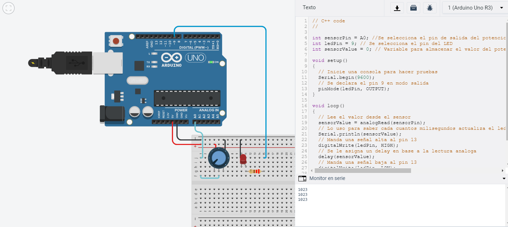

# Programación Microcontrolador Arduino

## :trophy: C3.4 Entradas analógica y salida digital

Arduino, entrada análoga, salida digital y uso de función serial a través de un potenciómetro, una resistencia y led.

---

## :blue_book: Instrucciones

- De acuerdo con la información presentada por el asesor referente al tema, desarrollar lo que se indica dentro del apartado siguiente.

---

## :pencil2: Desarrollo

1. Basado en el siguiente circuito, y utilizando uno de los simuladores propuestos, ensamblar lo que observa.

    

2. Analice y escriba el programa que se muestra a continuación.

     

3. Inserte aquí las imágenes que considere como evidencias para demostrar el resultado obtenido.

    > El siguiente circuito toma una entrada digital en modo salida y una entrada analogica. La salida digital establece una señal en modo alto o bajo para controlar el comportamiento de un LED, con ayuda de un potenciometro se controla la velocidad en que se alterna el encendido y apagado del LED, debido a que el potenciometro controla una señal analogica proporcionando un valor entre 0 y 1023 esto es equivalente a 1 milisegundos hasta 1 segundo con 2 milisegundos. 

    

---

### :bomb: Rubrica

| Criterios     | Descripción                                                                                  | Puntaje |
| ------------- | -------------------------------------------------------------------------------------------- | ------- |
| Instrucciones | Se cumple con cada uno de los puntos indicados dentro del apartado Instrucciones?            | 20 |
| Desarrollo    | Se respondió a cada uno de los puntos solicitados dentro del desarrollo de la actividad?     | 80      |

:house: [Ir a inicio](https://github.com/CarlosNavaR/SistemasProgramables)