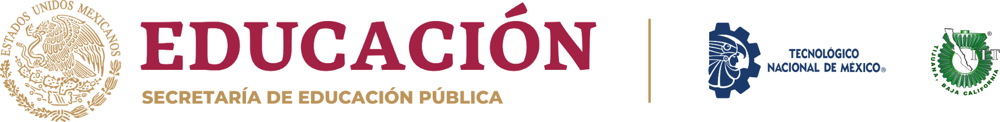

 
## 
:open_file_folder: Ingeniería en sistemas computaciones 
 ##
### 
:pushpin: Sistemas Programables :computer: 
 ###
##### 
:floppy_disk: SCC-1023SC7B 
 ####
### 
:calendar: Enero - Julio 2021 
 ###
***
# :clipboard: Datos del alumno
* **Nombre:** Nava Reyes Carlos
* **# Control:** 17212163
* **Equipo:** Los grumosos :bear:

---

# :necktie: Datos del asesor de la materia
* **Nombre:** Leonardo Enriquez Alvarez
* **Licenciatura:** Ingeniería electrónica, especialidad sistemas digitales
* **Maestría:** Tecnologías de la información y comunicación

# :books: Actividades 
1. [ :hourglass:  C0.1 Integrar equipos de trabajo](Blog/C0.1_IntegrarEquiposdeTrabajo.md "Individual")
2. [ :hourglass:  C1.1 Electronica basica y elemento](Blog/C1.1_ElectronicaBasica_y_elementos.md "Individual")
3. [ :hourglass:  C1.2 Electronica basica - Circuitos](Blog/C1.2_ElectronicaBasica_circuitos.md "Individual")
4. [ :hourglass:  C1.2 circuito electrónico division de tension](Blog/C1.3_Circuito_electrónico_divisor_tensión.md "Individual")

