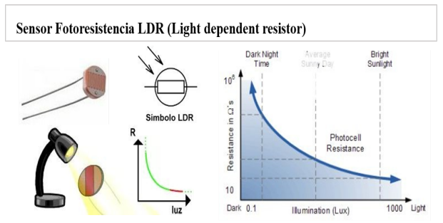
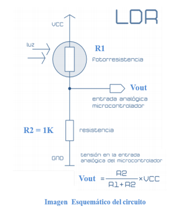

# :trophy: A1.2 Actividad de aprendizaje #

### Objetivo ###

Realizar un sensor medidor de luz (lux) a través de un circuito electrónico, utilizando un simulador, y un **LDR (Light dependent Resistor).**
___
### :blue_book: Instrucciones

- Se sugiere para el desarrollado de la presenta actividad, utilice uno de los siguientes simuladores:
Autodesk Tinkercad, Virtual BreadBoard, Easy EDA por lo cual habrá que familiarizarse antes, e incluso
instalarse o registrarse dentro de la plataforma.

___
### :pencil2: Desarrollo

1. Utilice el siguiente listado de materiales para la elaboración de la actividad y agregue en la columna "Fuente de consulta" su enlace bibliográfico.

| Cantidad | Descripcion | Fuente de consulta
|----------|-------------|-------------------|
| 1 | Sensor Fotoresistencia LDR de 2M| 
| 1 | Resistencia 1k |
| 1 | Fuente de alimentación de 5v. |

2. Considerando que el elemento LDR es un sensor fotoresistivo es decir varia su resistencia en base a la cantidad de luz que incide sobre el, **Que observa en el grafico siguiente?**

    

3. Ensamble el circuito que se muestra utilizado el simulador que halla considerado, colocando la fotorresistencia en la posición LDR y resistencia de acuerdo con la imagen del esquemático:

    

4. coloque la imagen finalmente obtenida del circuito ensamblado dentro de su simulador.
5. Mida la **resistencia** de la fotorresistencia con el ohmetro bajo las siguientes condiciones: ausencia de luz u oscuridad, luz ambiente, luz intensiva y registre en la tabla correspondiente.
6. Calcule el **valor de voltaje Vout teórico** para cada una de las condiciones antes indicadas asi como el valor de voltaje Vout medido y registre en la tabla correspondiente.
7. Calcule el **valor de exactitud** de voltaje entre lo teórico y lo medido para cada condición y registre en la tabla correspondiente.

| Numero | Condición | Impedancia en fotoresistencia | Voltaje Vout teorico | Voltaje Vout medido | % V.Medido / V.Teorico |
| --- | --- | --- | --- | --- | --- |
| Ausencia de luz
| Luz ambiental
| Luz intensa 

8. **Grafique** a través de los valores registrados en la tabla anterior de tal manera que se pueda observar el comportamiento de la curva del componente LDR e **inserte la grafica**.
9. Inserte imágenes de **evidencias** tales como son reuniones de los integrantes del equipo realizadas para el desarrollo de la actividad.
10. Incluya las conclusiones individuales y resultados observados durante el desarrollo de la actividad.

---
### :bomb: Rubrica

| Criterios     | Descripción                                                                                  | Puntaje |
| ------------- | -------------------------------------------------------------------------------------------- | ------- |
| Instrucciones | Se cumple con cada uno de los puntos indicados dentro del apartado Instrucciones?            | 10 |
| Desarrollo    | Se respondió a cada uno de los puntos solicitados dentro del desarrollo de la actividad?     | 60   |
| Demostracion | El alumno se presenta durante la explicación de la funcionalidad de la actividad? | 20
| Conclusiones | Se incluye una opinión personal de la actividad por cada uno de los integrantes del equipo? | 10

:house: [Ir a inicio](https://github.com/CarlosNavaR/SistemasProgramables)