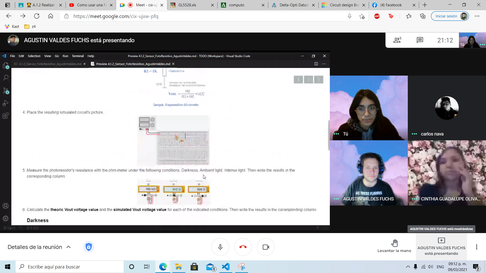

## :trophy: A.1.2 Learning activity

## Objective

Create a light measuring sensor via an electronic circuit, using a simulator and a **LDR (Light dependent Resistor)**.
___

### :pencil2: Development

1. Use the following list of components for the activity's development, and add a link as _reference_ to the table.

    | Quantity | Description                 | Reference                                                                                                                 |
    | -------- | --------------------------- | ------------------------------------------------------------------------------------------------------------------------- |
    | 1        | 2M&#8486; Photoresistor LDR | [Photoresistor](https://pi.gate.ac.uk/pages/airpi-files/PD0001.pdf)                                                       |
    | 1        | 1k&#8486; Resistor          | [Resistor](http://www.juntadeandalucia.es/averroes/centros-tic/29009909/helvia/aula/archivos/_56/RESISTENCIAS-TABLAS.pdf) |
    | 1        | 5v Power supply             | [Power suply](https://shopdelta.eu/pdf.php?page=shop/datasheet&product_id=7952)                                           |

2. Considering the LDR is a photoresistive sensor, meaning that it's electrical resistance depends on how much luminosity it receives, **What can be observed in the following graph?** 
   
    <p align="center">
    
    </p>

> That when theres more ilumination exposed to the photoresistor, theres less resistance as a result, but if theress less ilumination theres more resistance.

3. Build the circuit using the chosen simulator, using the photoresistor, and resistor as shown in the following schematic:

    <p align="center"> 
    
    </p>

4. Place the resulting simulated circuit's picture.

    <p align="center"> 
    
    </p>

5. Measure the photoresistor's resistance with the ohm-meter under the following conditions: Darkness, Ambient light, Intense light.
    
    <p align="center"> 
    
    </p>

6. Calculate the theoric Vout voltage value for each of the conditions.
   
    >Vout = (1000Ω)\*(5v) / (180000Ω+1000Ω) = 0.0276 v  
    Vout = (1000Ω)\*(5v) / (912Ω+1000Ω) = 2.61 v  
    Vout = (1000Ω)*(5v) / (506Ω+1000Ω) = 3.32 v  

7. Measure the **simulated Vout voltage value** for each of the indicated conditions.
    
    #### Darkness

    <p align="center"> 
    
    </p>

    #### Ambient Light

    <p align="center"> 
    
    </p>

    #### Intense Light

    <p align="center"> 
    
    </p>

8. Calculate the accuracy of the resulting voltages between the theoric and measured for each of the conditions, consider including in this section an explanation for the procedure used for the calculation of the theoric values.

    >%Darkness = (27.7 mv / 27.6 mv) * 100 = 99 %  
    %AmbientLight = (2.61 v / 2.61 v) * 100 = 100%  
    %IntenseLight = (3.32 v / 3.32 v) * 100 = 100%  


9. *Measure the photoresistor's resistance with the ohm-meter under the following conditions: Darkness, Ambient light, Intense light. Then write the results in the corresponding column.*
10. *Calculate the theoric Vout voltage value and the simulated Vout voltage value for each of the indicated conditions. Then write the results in the corresponding column.*
11. *Calculate the **accuracy value** between the theoric and measured voltage for each condition.* Then write the results in the corresponding column.

    | Conditions    | Photoresistor resistance | Vout theoric voltage | Vout measured voltage | %  V.Measured/ V.Theoric |
    | ------------- | ------------------------ | -------------------- | --------------------- | ------------------------ |
    | Darkness      | 180k &#8486;             | 27.6 mv              | 27.7 mv               | 99%                      |
    | Ambient light | 912 &#8486;              | 2.61 v               | 2.61 v                | 100%                     |
    | Intense light | 506 &#8486;              | 3.32 v               | 3.32 v                | 100%                     |


12. Create a graph using the valuess registered in the previous table, where the "X" axis represents the measured Vout voltage, and the "Y" axis represents the resistance presented by the photoresistor. Then insert the graph.

    <p align="center"> 
    
    </p>

13. Insert picture **evidence**, such as the team meetings made for the activity's development.

    <p align="center"> 
    
    </p>
    <p align="center"> 
    
    </p>


14.  Iclude individual conclusions and resulting observations that took place during the activity's development.

### Los grumosos :bear: Conclusions.
##### Nava Reyes Carlos 
```
The main objective of this practice was analyze and understand how LDR sensor works, simulating a circuit as a practice where  the flow of the
resistance  is directly observed increases or decreases due to light level in the environment, the  main problems for me were the lack of 
knowledge of electronics and how the simulation tool works, but at the end was easy because the team has a good communication.
```
##### Olivas Calderon Cinthia Guadalupe
```
In this activity we were able to observe the operation of a photoresistor when exposed to different types of light, for example, when it was exposed to intense light, the resistance value decreased. On the contrary, when it is in darkness, the resistance value will be increased to the maximum. As can be seen in the graph and in the calculations made, the voltage changes depending on the light that reaches the photoresistor, in the dark the voltage decreased and when it is very illuminated the voltage increased.
```
##### Ontiveros Lara Claudia Sarahi
```
After the practice I was able to understand how an LDR sensor works, basically when it is exposed to higher illumination it presents less 
resistance and in the opposite case more resistance. The teamwork was easy thanks to the use of the simulator and the meet tool, in addition
to the fact that everyone complements the work in one way or another, either by making calculations, simulating, and so on. 
The most complicated thing to do was the graph of the results of the table, since it was not so easy to see how it behaved due to the large
scale of the results.
```
##### Valdés Fuchs Agustín  
```
While doing the activity, I observed how the photoresistor behaves while in use along other components, how the light decreases the resistance, and how if it decreases the resistance rises.
The photoresistant while under no light could almost completely stop the electricity, and from that to only block it partially while under 
direct light.
We divided the activity among ourselves to better meet our strenghts, we were able to complete most of the activity within an hour.
```
___

### :octopus: Github links

##### :church: [Carlos Nava](https://github.com/CarlosNavaR/SistemasProgramables)
##### :princess: [Cinthia Olivas](https://github.com/OlivasCinthia/Sistemas-programables.git)
##### :octocat: [Claudia Ontiveros](https://github.com/OntiverosClaudia/SistemasProgramables.git)
##### :alien: [Agustin Valdes](https://github.com/dasgrossfuchs/SistemasProgramables)
