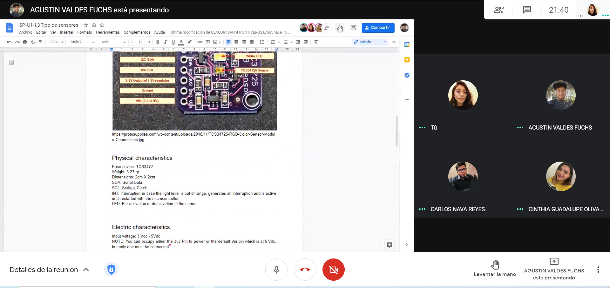

## :trophy: A.1.3 Learning activity

## Objective

Elaborate an investigation and presentation to be exposed during class on the topic of sensors.
___

### :pencil2: Development

1. Make use of the following list of sensors for the development of the activity:

   - [ ] 1.1 Infrared encoder sensor
   [FC-03](https://articulo.mercadolibre.com.mx/MLM-667245832-sensor-de-velocidad-encoder-infrarrojo-lm393-encoder-1-pz-_JM?quantity=1#position=1&type=item&tracking_id=d291ac0d-e965-42ec-8f24-9c21dba0524e)
   - [ ] 1.2 Presense pair emitor/receptor sensor
   [QRD1114](https://articulo.mercadolibre.com.mx/MLM-761860464-2-pzas-qrd1114-sensor-infrarrojo-reflectivo-seguidor-linea-_JM?quantity=1#position=3&type=item&tracking_id=a56bb0cb-d5dc-4f43-84cd-9e46feaa1cc6)
   - [ ] 1.3 Ultrasonic presense detector sensor
   [HC-SR04](https://articulo.mercadolibre.com.mx/MLM-780669402-sensor-ultrasonico-hc-sr04-sensor-de-distancia-_JM?quantity=1#position=1&type=item&tracking_id=aa4551b9-6b85-4a0d-b119-00b31360c7a4)
   - [ ] 1.4 Temperature and humidity sensor
   [DHT11](https://articulo.mercadolibre.com.mx/MLM-664315278-sensor-de-temperatura-y-humedad-dht11-cjumpers-arduino-pic-_JM?quantity=1#position=1&type=item&tracking_id=e28e7442-6ce8-420b-99e1-99b2efd2d51f)
   - [ ] 1.5 Temperature and humidity sensor
   [DHT12](https://articulo.mercadolibre.com.mx/MLM-761350149-sensor-de-temperatura-y-humedad-dht22-arduino-_JM?quantity=1#position=1&type=item&tracking_id=509ff3d0-c091-4fbc-8ff5-63ff0c0adaec)
   - [x] 1.6 RGB color sensor [TCS34725](https://cdn-shop.adafruit.com/datasheets/TCS34725.pdf)
   - [ ] 1.7 Infrared Remote Control sensor
   [AX-1838HS](https://articulo.mercadolibre.com.mx/MLM-665821120-modulo-sensor-reconocimiento-de-color-rgb-tcs34725arduino-_JM?quantity=1#position=1&type=item&tracking_id=fd55dc31-3426-49ad-999f-ef5cf0a70bf0)
   - [ ] 1.8 Infrared Reflective Sensor
   [TCRT5000](https://articulo.mercadolibre.com.mx/MLM-602097604-modulo-tcrt5000-sensor-optico-reflectivo-arduino-pic-_JM?quantity=1#position=1&type=item&tracking_id=6e9e4318-5969-4b28-a765-17a08bd5dc3f)
   - [ ] 1.9 Movement sensor[PIR
   HC-SR501](https://articulo.mercadolibre.com.mx/MLM-603369291-sensor-de-movimiento-pir-hc-sr501-arduino-pic-_JM?quantity=1#position=1&type=item&tracking_id=59121a6f-e868-4aa0-ae14-430f1cfd2158)
   - [ ] 1.10 Optic distance sensor [Sharp
   2Y0A02/GP2Y0A02YK0F](https://articulo.mercadolibre.com.mx/MLM-554899938-sensor-infrarrojo-sharp-gp2y0a02yk-2y0a02-20-150cm-_JM?quantity=1#position=1&type=item&tracking_id=155e5495-de69-4b76-a797-826cda4686c2)


2. Redact on this document the following points.

<br>

   <p align="center">
      
   </p>
   <div align="center">
   <h3>Career : systems engineering</h3>
   <h4>Professor : Jaime Leonardo Enriquez Alvarez</h4>
   <h4>Assignment : RGB color sensor TCS34725</h4>
   <h4>Date : April 12th 2021 </h4>
   <h4>Team : Los Grumosos 🐻</h4>
   <h4>Students:</h4>

   <table style="padding-left: 30%;">
      <thead>
         <tr>
            <th>No.</th>
            <th>Name</th>
            <th>Control No.</th>
         </tr>
      </thead>
      <tbody>
         <tr>
            <td>1</td>
            <td>Nava Reyes Carlos</td>
            <td>17212163</td>
         </tr>
         <tr>
            <td>2</td>
            <td>Olivas Calderon Cinthia Guadalupe</td>
            <td>17212165</td>
         </tr>
         <tr>
            <td>3</td>
            <td>Ontiveros Lara Claudia Sarahi</td>
            <td>17212167</td>
         </tr>
         <tr>
            <td>4</td>
            <td>Valdés Fuchs Agustín</td>
            <td>17211569</td>
         </tr>
      </tbody>
   </table>
   </div>
   <hr>

   <div>
      <h2>Introduction</h2>
      <p>
         Throughout this documentation we will explain the operation of the RGB color sensor <a href="https://cdn-shop.adafruit.com/datasheets/TCS34725.pdf">TCS34725</a>, as well as its physical and electrical characteristics, among other aspects in order to correctly understand the handling of this sensor.<br>
         The RGB color recognition sensor module TCS34725 is one of the best recognition sensors on the market for Arduino or Raspberry Pi.<br>
         TCS34725 it has elements to measure RGB and white light. It has an integrated IR blocking filter, which minimizes the IR spectrum, achieving very precise color measurements. This makes the readings correspond to "true" or visible color since humans do not see the IR spectrum.<br>
      </p>
      <h2>Definition</h2>
      <p>
         The <a href="https://protosupplies.com/wp-content/uploads/2018/11/TCS34725-RGB-Color-Sensor-Module-Connections.jpg">TCS34725</a> device provides a digital return of red, green, blue (RGB), and clear light sensing values, It has integrated infrared blocking filter, which minimizes the infrared spectrum achieving very precise color measurements, provide an ideal color sensor solution for use under varying lighting conditions and  through attenuating materials. <br>
         The TCS3472, itself, can enter a lower-power wait state between light sensing measurements to further reduce the average power consumption.
      </p>
      <h2>
      <a href="https://protosupplies.com/wp-content/uploads/2018/11/TCS34725-RGB-Color-Sensor-Module-Connections.jpg">Picture of the sensor</a></h2>
      <p align="center">
      
      </p>
      <h2><a href="https://cdn-shop.adafruit.com/datasheets/TCS34725.pdf">Physical characteristics</a></h2>
      <ul><li>Base device: TCS34725</li><li>Weight: 3.23 gr</li><li>Dimensions: 2cm X 2cm</li><li>SDA: Serial Data</li><li>SCL: Serial Clock</li><li>INT: interruption in case the light level is out of range, generates an interruption and is active until restarted with the microcontroller.</li><li>LED: For activation or deactivation of the same.</li></ul>
      <h2><a href="https://cdn-shop.adafruit.com/datasheets/TCS34725.pdf">Electric characteristics</a></h2>
      <ul><li>Input voltage: 3 Vdc - 5Vdc</li>
      NOTE: You can occupy either the 3v3 Pin to power or the default Vin pin which is at 5 Vdc, but only one must be connected.
      <li>Input current: up to 20mA</li>
      <li>Power: 60mA - 100mA</li>
      </ul>
      <h2><a href="https://cdn-shop.adafruit.com/datasheets/TCS34725.pdf">Behavior in the environment</a></h2>
      <p>
      Optical Characteristics, VDD = 3 V, TA = 25C, AGAIN = 16, ATIME = 0xF6 (unless otherwise noted)
      <p align="center">
      
      </p>
      NOTES: 
      <ol>
      <li>The percentage shown represents the ratio of the respective red, green, or blue channel value to the clear channel value.</li>
      <li>The 465 nm input irradiance is supplied by an InGaN light-emitting diode with the following characteristics: dominant wavelength λD = 465 nm, spectral halfwidth Δλ½ = 22 nm.</li>
      <li>The 525 nm input irradiance is supplied by an InGaN light-emitting diode with the following characteristics: dominant wavelength λD = 525 nm, spectral halfwidth Δλ½ = 35 nm.</li>
      <li>The 615 nm input irradiance is supplied by a AlInGaP light-emitting diode with the following characteristics: dominant wavelength λD = 615 nm, spectral halfwidth Δλ½ = 15 nm.</li>
      </ol>
      </p>
      <h2><a href="https://cdn-shop.adafruit.com/datasheets/TCS34725.pdf">Applications</a></h2>
      <p>
      The TCS3472 color sensor has a wide range of applications including RGB LED backlight control, solid-state lighting, health/fitness products, industrial process controls and medical diagnostic equipment.<br>
      Ambient light sensing is widely used in display-based products such as cell phones, notebooks, and TVs to sense the lighting environment and enable automatic display brightness for optimal viewing and power savings.<br>
      Other generic applications include:
      <ul>
      <li>RGB LED Backlight Control</li>
      <li>Light Color Temperature Measurement</li>
      <li>Ambient Light Sensing for Display</li>
      <li>Backlight Control</li>
      <li>Fluid and Gas Analysis</li>
      <li>Product Color Verification and Sorting</li>
      <ul>
      </p>
   </div>

   ### Los grumosos :bear: Conclusions.
   ##### Nava Reyes Carlos 
   ```
   With the research we achieved a great understanding of how the TCS34725 sensor works because it is one of the most used in the area of Arduino and Raspberry pi, for this reason makes it have extensive information about how it works and its main characteristics.
   ```
   ##### Olivas Calderon Cinthia Guadalupe
   ```
   Analyzing the information collected about the TCS34725 RGB color sensor, we can highlight the way the sensor recognizes colors, this is done by means of an integrated infrared blocking filter which allows it to show us more real color measurements. It is a sensor that can be used on Arduino and Raspberry pi, so for future projects a more extensive investigation will have to be carried out.
   ```
   ##### Ontiveros Lara Claudia Sarahi
   ```
   After researching the RGB color sensor TCS34725 I could better understand some important and basic points about this, being that it is a very useful component, besides that it will be used in some future practice. The hardest thing about teamwork was managing the times, because we had a limit.
   ```
   ##### Valdés Fuchs Agustín  
   ```
   With this practice I was able to understand the functions available when using a TCS3472 RGB color sensor, as it outputs a digital signal that is usable by an arduino or any other microcontroller, this signal is then interpreted and contains information on the percentage of the color detected corresponds to Red, Green, or Blue, as with any digital signal, this can be then used for any application.
   The teamwork was made easy by using meet to hold videocalls, VSCode with liveshare to work alongside our teammates and Canva to create the presentation.
   ```
   <br>

   <p align="center">
   <a href="https://www.canva.com/design/DAEbI0StLLQ/46xct15WfgWd4gSix8rq0Q/view"></a>
   </p>


1. Insert picture **evidence** such as the team meetings made for the development of the activity.

   <p align="center">
   
   </p>
___

### :octopus: Github links

##### :church: [Carlos Nava](https://github.com/CarlosNavaR/SistemasProgramables)
##### :princess: [Cinthia Olivas](https://github.com/OlivasCinthia/Sistemas-programables.git)
##### :octocat: [Claudia Ontiveros](https://github.com/OntiverosClaudia/SistemasProgramables.git)
##### :alien: [Agustin Valdes](https://github.com/dasgrossfuchs/SistemasProgramables)

