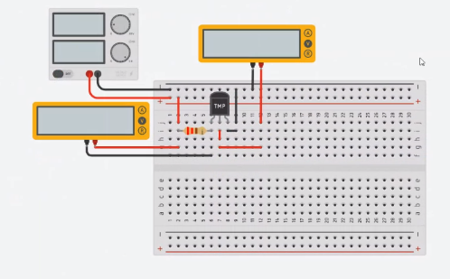
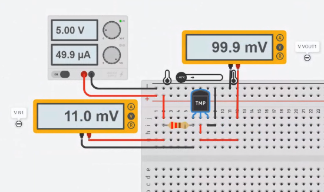
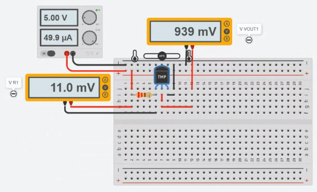
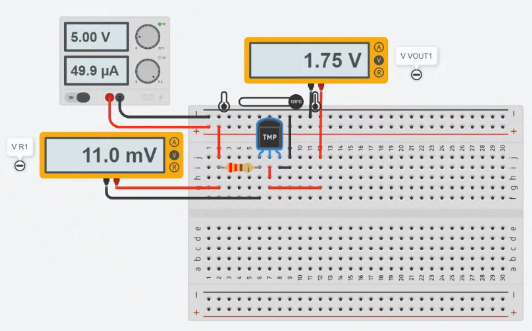
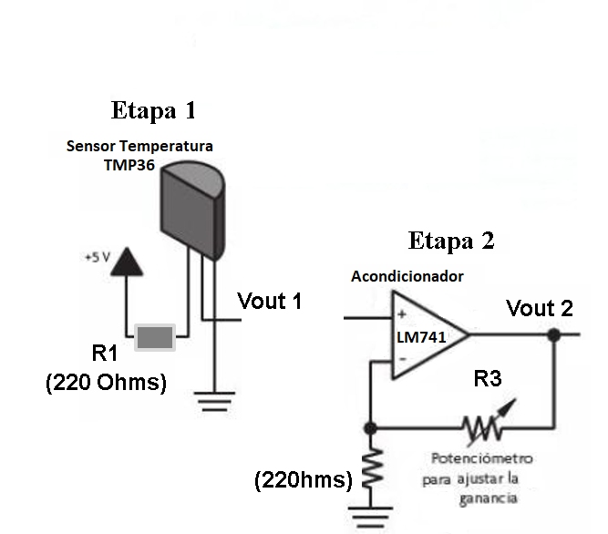
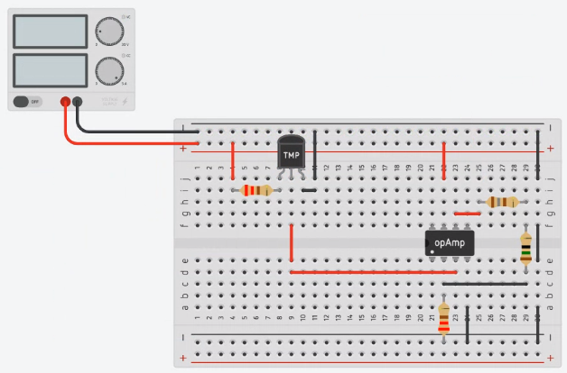
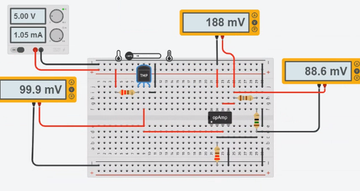
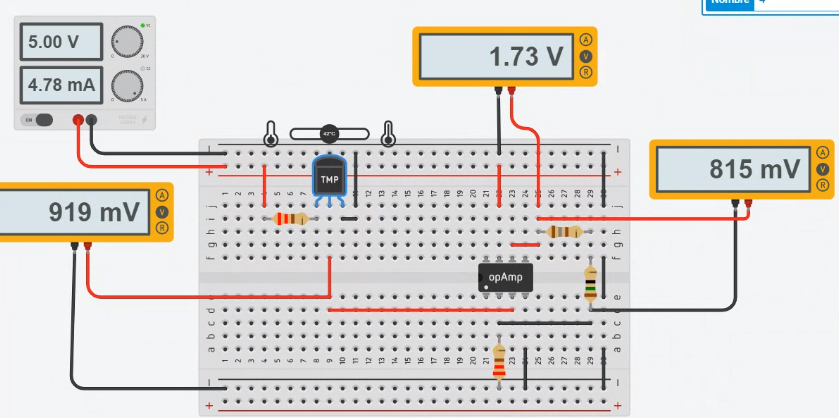
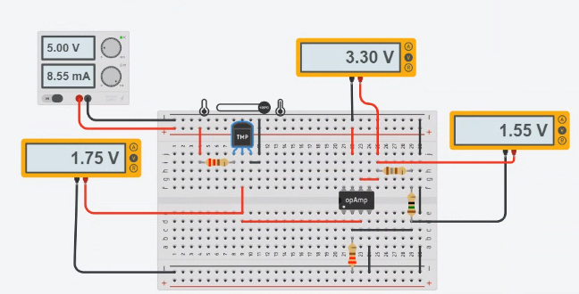
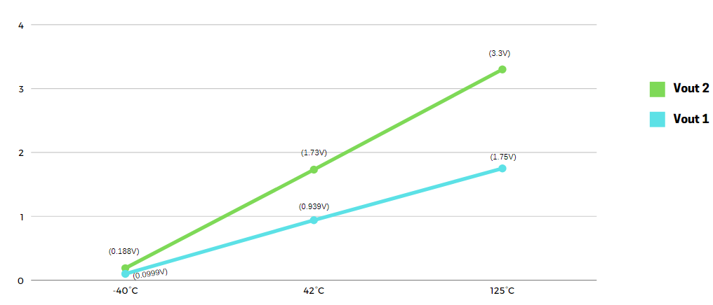

# Sensors

## :trophy: A.1.4 Learning activity

## :pencil2: Development

1. Use the following list of materials for the activitie's development.

    | Cuantity | Description                 | Reference                                                                                                                  |
    | -------- | --------------------------- | -------------------------------------------------------------------------------------------------------------------------- |
    | 1        | TMP36 Temperature sensor    | [TMP36](https://www.analog.com/media/en/technical-documentation/data-sheets/TMP35_36_37.pdf)                               |
    | 1        | 10k Potenciometer           | [10k Potenciometer](https://components101.com/asset/sites/default/files/component_datasheet/potentiometer%20datasheet.pdf) |
    | 2        | 220 Ohms resistors          | [220 Ohms Resistance](https://www.arduino.cc/documents/datasheets/Resistors.pdf)                                           |
    | 1        | LM741 operational amplifier | [LM741](https://www.ti.com/lit/ds/symlink/lm741.pdf)                                                                       |
    | 1        | 5Volts Power supply         | [5Volts](https://shopdelta.eu/fuente-de-alimentacion-5v2a5-5_l6_p7952.html)                                                |

    For more information use the following links:
    - Information and especifications of [**TMP36 Sensor**](https://components101.com/sites/default/files/component_pin/TMP36-Sensor-Pinout.png)  
    - Information and especifications of [**LM741 Operational Amplifier**](https://ortegamraul.files.wordpress.com/2014/03/741-interno.png)

2. Based on the picture, assemble by simulator the electronic circuit stage 1, placing the **TMP36** in the indicated position.

    <p align="center">
        
    </p>

    <p align="center">
        
    </p>

3. Calculate, measure and register on the next table, the solicited values for Vout1, under the 3 required conditions.

    <p align="center">
        
    </p>

    <p align="center">
        
    </p>

    <p align="center">
        
    </p>
    
    | No. | Condition | Vout1 measured Voltage | R1 measured Voltage | Indicated temperature |
    | --- | --------- | ---------------------- | ------------------- | --------------------- |
    | 1   | Minimum   | 99.9mV                 | 11mV                | -40 C                 |
    | 2   | Medium    | 939mV                  | 11mV                | 42 C                  |
    | 3   | Maximum   | 1.75V                  | 11mV                | 125 C                 |


4. Using the picture of the TMP36 transistor that corresponds to the stage 1, conect the Vout1 terminal to the non inversor terminal of the LM741, and assemble the circuit corresponding to stage 2.

    <p align="center">
        
    </p>

    <p align="center">
        
    </p>

5. **Whats value should R3 have on the circuit stage 2, for it to accieve a Vout2 = 3.3 volts,** for the maximum condition of temperature that the sensor is able to detect? As can be seen the resistance R3 corresponds to a potenciometer, nevertheless arrangements can be made with the resistances to obtain a finer adjustment. What could be the reason theres a requirement for an **adjustment of a 3.3 Volts**?
   
    >Vout = Vin (1 + R2/R1)
    3.3v = 1.75 (1 + R2/220Ω)  
    3.3v/1.75v = 1 + R2/220Ω  
    1.885 - 1 = R2/220Ω  
    (0.885) (220Ω) = 194.85Ω  (used 180Ω + 15Ω resistances) 
    Because of the sum of the input voltage (the output of the circuit made before) at maximum temperature is 1.75, given that the operational amplifier is powered by the same power supply, if it were more , the operational amplifier would stop functioning correctly.

6. Once the values of R3 are adjusted, registered the obtained values for Vout2, for each of the conditions shown in the next table.

    <p align="center">
        
    </p>
    
    <p align="center">
        
    </p>

    <p align="center">
        
    </p>

    | No. | Condition | R2 measured Voltage | Vout2 measured Voltage | Indicated temperature |
    | --- | --------- | ------------------- | ---------------------- | --------------------- |
    | 1   | Minimum   | 88.6mV              | 188mV                  | -40 C                 |
    | 2   | Medium    | 815mV               | 1.73V                  | 42 C                  |
    | 3   | Maximum   | 1.55V               | 3.3V                   | 125 C                 |

7. Graphic Vout1 and Vout2, for the 3 prior conditions, using "X" as the temperature values and "Y" as the voltage values.

    <p align="center">
        
    </p>

### Los grumosos :bear: Conclusions.
##### Nava Reyes Carlos 
```
TMP36 sensor can provide power supply to another component, the interesting thing is that the voltage that this sensor provides is based on the temperature of the environment,this sensor takes as a basis that the higher temperature higher voltage can provide to power other components, this practice was divided in two parts the first part was about TMP36 sensor and the second part is to amplify the voltage that provides the TMP36 sensor(part one) with an operational amplifier, the behavior that both components in the same circuit was very interesting because the resistor affected too much the behavior of the circuit due to very high resistance values made the power supply was not enough or created a voltage overflow and will not work correctly.
```
##### Olivas Calderon Cinthia Guadalupe
```
In this practice we were able to observe that in the TMP36 temperature sensor its supply voltage is between 2.7V and 5.5V, also the Vout that it will provide will depend on the temperature in which it is located and it will give us analog voltage between 0 and 1.75V. We also realized that with the resistor arrangement we were able to reach the voltage of 3.3V.
Investigating we found that the temperature can be calculated by having the Vout and a mathematical formula.
```
##### Ontiveros Lara Claudia Sarahi
```
In this practice we use the TMP36 component to measure the temperature of a signal input, as well as understand the functioning of its pins, as well as its function in the circuit, being that at lower temperature the sensor is exposed, lower voltage value will have the output, otherwise, vout will be higher. At the time of integrating stage one with stage two, the potentiometer was replaced by an array of resistors to obtain a more accurate result (3.3 v), and that was the most conflicting of the practice.
```
##### Valdés Fuchs Agustín  
```
In this practice we used TinkerCAD to simulate the use of a TMP36 temperature sensor along with an operational amplifier to create a circuit capable of outputting a voltage based on the given temperature, the observable result was a correlation of the temperature and the voltage output, as given a lower temperature the voltage was lower than with a higher one. It was easy to organize and prepare for the simulation, however the most challenging part was with issues presented by the simulator and some of the parts. 
```
___

### :octopus: Github links

##### :church: [Carlos Nava](https://github.com/CarlosNavaR/SistemasProgramables)
##### :princess: [Cinthia Olivas](https://github.com/OlivasCinthia/Sistemas-programables.git)
##### :octocat: [Claudia Ontiveros](https://github.com/OntiverosClaudia/SistemasProgramables.git)
##### :alien: [Agustin Valdes](https://github.com/dasgrossfuchs/SistemasProgramables)

