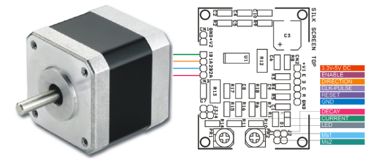
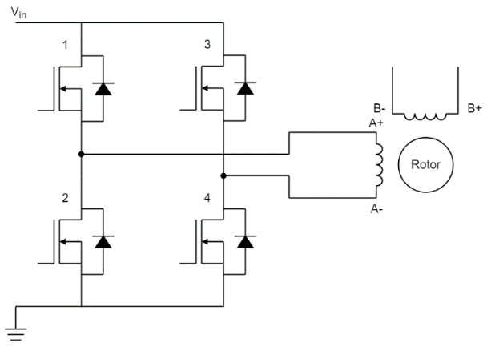
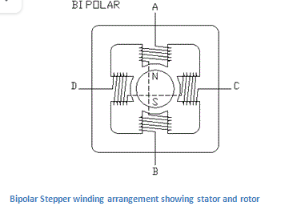

# Sensors

## :trophy: A.2.1 Learning activity

## :pencil2: Development

1. Use the following list of electric actuator models for the development of the activity.

    - [ ] Dual Axis Gear Motor
    - [ ] Unipolar step motor
    - [x] Bipolar step motor
    - [ ] SG90 Servomotor

2. Once the professor indicates the team's actuator mark it on the list.

3. Investigate and redact the following points:

- portada

    <p align="center">
      
   </p>

    #### Career : systems engineering
    #### Professor : Jaime Leonardo Enriquez Alvarez
    ##### Assignment : RGB color sensor TCS34725
    ##### Date : May 4th 2021
    ##### Team : Los Grumosos 🐻
    ##### Students:

    | Control No. | Name                              |
    | ----------- | --------------------------------- |
    | 17212163    | Nava Reyes Carlos                 |
    | 17212165    | Olivas Calderon Cinthia Guadalupe |
    | 17212167    | Ontiveros Lara Claudia Sarahi     |
    | 17211569    | Valdés Fuchs Agustín              |
    

    ### Introduction
    Stepper motors can rotate and stop with an accuracy of the order of hundredths of a millimeter. This high precision and their reliability destined them to be used in a large number of electronic devices. We are going to explain the operation of one of the types of permanent magnet motors, which is the bipolar motor that has a single winding per phase and without a center tap (unlike a unipolar stepper motor).

    ### Content
    #### Definition

    A stepper motor is a brushless DC motor that divides a full rotation into several equal steps. The motor’s position can then be directed to move and hold at one of these steps without any position sensor for feedback (an open-loop controller). Bipolar stepper motors are a type of stepper motor with a single winding per phase and no center tap (unlike a unipolar stepper motor)

    ##### [Unipolar vs Bipolar stepper motor](https://www.youtube.com/watch?v=vxxnPJBxG3M)

    The bipolar stepper motor has a full winding, which compared to the unipolar’s half winding, has a stronger torque force.
    It uses thicker wiring, this has an increase in resistance, which by following logic has an increased voltage requirement and it also heats easily.
    Finally its wiring is more complex, more spacious and can get to be more costly.

    #### Actuator's pictures

    <p align="center">
      
    </p>

    #### [Physical characteristics](https://www.electrical4u.com/bipolar-stepper-motor/)

    - Frame size 57 x 57mm
    - Length 56mm
    - Diameter of axis Φ6.35mm
    - Length of axis 21mm
    - Number of leads 4
    - Length of cable 500mm
    - Weight 700g

    #### [Electrical characteristics](https://www.electrical4u.com/bipolar-stepper-motor/)

    - Type of engine Bipolar
    - Engine angle 1.8°
    - Holding torque (Holding Torque)  1.26Nm(178.5 oz/in) (12.85 Kg/cm)
    - Rated current / phase 2.8A
    - Phase resistance 0.9ohms
    - Voltage 2.5V
    - Inductance 2.5mH 20%(1KHz)

    #### [Working principle](https://www.electrical4u.com/bipolar-stepper-motor/)

    
    <p align="center">
      
    </p>
    <p align="center">
      
    </p>

    1. Only one of the phase winding is energized at a time. That is, either AB or CD is energized. Of course, the coils will be energized in such a way that we get correct polarity. But only one phase is energized. This type of stepping will give less holding torque because only one phase is energized.
    2. In this method, both the phases are activated at the same time. The rotor will align itself between two poles. This arrangement will give higher holding torque than the previous method.
    3. The third method is used for half stepping. This method is used generally to improve the stepping angle.  Here, in step 1, only 1 phase is ON, then in step 2, 2 phases are ON, then again, only one phase is ON, and the sequence continues.

    #### [Applications](https://www.monolithicpower.com/en/stepper-motors-basics-types-uses)

    - On desktop printers
    - In 3d printers/prototyping machines
    - In the construction of small-medium power CNC machines.
    - On routers.
    - Laser cutters
    - Pick and place machines
    - Linear actuators
    - Hard drives

### Los grumosos 🐻 Conclusions.
##### Nava Reyes Carlos 
```
The stepper motor in general are present in our daily life in different devices, based on this research I understood the different applications in which this motor is present, based on the different areas that this is applied, it can be seen that so much potential can have this type of motors in specific bipolar stepper motor. which can obtain more power by sacrificing a high voltage, the bipolar stepper motor can work in different ways with the help of other components that control its operation and power that can come to generate.
```
##### Olivas Calderon Cinthia Guadalupe
```
When doing the research I was able to realize that bipolar stepper motors can be controlled using pulses and with these it will rotate a certain number of degrees. They also have a specified number of steps to turn the full turn. These motors are used in many electronic devices that we use every day and what interested me was to see them applied in the 3D printer that uses the stepper motor.
```
##### Ontiveros Lara Claudia Sarahi
```
After doing this research I understood the basic way this motor works, I think it is interesting to know specific information and applications that can be given to them, as this is precisely what makes an motor or any component, is appropriate to our needs or not. For example, we had already seen this type of motor in the video of how a 3D printer works and we had been given enough information to be able to determine the reason why this motor is used in that printer, in this case for its great precision.
```
##### Valdés Fuchs Agustín  
```
After this investigation I was able to understand the importance of using the different kinds of actuators and their variants, it can be beneficial to know their limits, upsides and downsides, as it may be important when building a circuit that theyre taken into account, we also included some of the main differences between the bipolar and the monopolar or unipolar stepper motor, mainly because we had the intrigue but thought it might be important knowledge in the long run.
```
<p align="center">
      
    </p>
___

### :octopus: Github links

##### :church: [Carlos Nava](https://github.com/CarlosNavaR/SistemasProgramables)
##### :princess: [Cinthia Olivas](https://github.com/OlivasCinthia/Sistemas-programables.git)
##### :octocat: [Claudia Ontiveros](https://github.com/OntiverosClaudia/SistemasProgramables.git)
##### :alien: [Agustin Valdes](https://github.com/dasgrossfuchs/SistemasProgramables)

