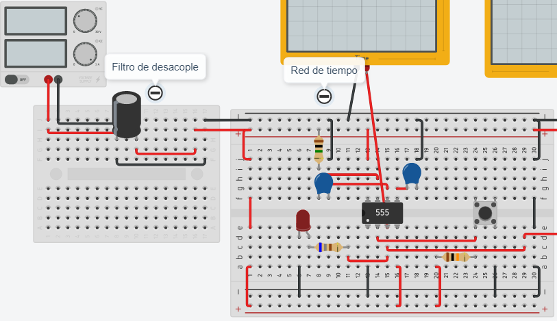

# Actuators

# :trophy: A.2.2 Learning activity

### :pencil2: Development

1. Use the following list of materials for the elaboration of the activity.

    | Quantity | Description                                                                                                                                                                                                                                                                                               |
    | -------- | --------------------------------------------------------------------------------------------------------------------------------------------------------------------------------------------------------------------------------------------------------------------------------------------------------- |
    | 1        | [**LM555** Integrated Circuit](https://www.ti.com/lit/ds/symlink/lm555.pdf)                                                                                                                                                                                                                               |
    | 1        | [**47uf** Electrolytic Capacitor](https://components101.com/capacitors/electrolytic-capacitor-pinout-datasheet)                                                                                                                                                                                           |
    | 1        | [**10nf** Ceramic Capacitor](http://www.agspecinfo.com/pdfs/C/CERAMICO.PDF)                                                                                                                                                                                                                               |
    | 1        | [**9V** Power Supply](https://naylampmechatronics.com/fuentes-switching/833-fuente-de-alimentacion-dc-9v-1a.html)                                                                                                                                                                                         |
    | 1        | [**TIP122** Power Transistor](https://alltransistors.com/adv/pdfdatasheet_kec/tip122.pdf )                                                                                                                                                                                                                |
    | 1        | [**1N4001** or equivalent Diode](https://www.vishay.com/docs/88503/1n4001.pdf)                                                                                                                                                                                                                            |
    | 1        | [**DC** Mini Motor](https://components101.com/motors/toy-dc-motor)                                                                                                                                                                                                                                        |
    | 3        | **[680](https://tostatronic.com/store/componentes-pasivos/896-resistencia-680-ohms-14w.html), [1k](https://tostatronic.com/store/componentes-pasivos/887-resistencia-1k-ohms-14w.html), [10k](https://tostatronic.com/store/componentes-pasivos/886-resistencia-10k-ohms-14w.html)** Ω **1/4w** Resistors |
    | 1        | [Button](https://www.mouser.mx/datasheet/2/140/P010453B-267752.pdf)                                                                                                                                                                                                                                       |
    | 1        | [**RED** LED Diode ](http://www.fullwat.com/documentos/00379-LNK02440.pdf)                                                                                                                                                                                                                                |


2. Use the electric circuit from the following picture and assemble Stage 1 in the simulator.

    <p align="center">
        
    </p>

3. As can be seen in the circuit shown before theres an area identified as "*Time Network*" and "*Decoupling filter*", **Explain the purpose of both**.

    >**Time Network**, It's the section made up by the resistor and the capacitor, this "network" are directly proportional to the time the NE555 timer will work.

    >**Decoupling filter**, An Electrolytic Capacitor is connected into the power input and output of the circuit to function as a filter that clears any unwanted frequencies.

4. Following the previous picture, see the equation **Ct = 1.1 * R1 * C1**, which is used to stablish the time of **output pulse**. Based on it, obtain the values of **R1 and C1** if the output pulse is to be maintained on, with the 3 conditions in the following table.

    | No. | Condition | R1  | C1     |
    | --- | --------- | --- | ------ |
    | 1   | 3 sec     | 1MΩ | 2.72µF |
    | 2   | 5 sec     | 1MΩ | 4.54µF |
    | 3   | 8 sec     | 1MΩ | 7.27µF |

    >1st Condition (3s)  
    **Ct** = 3s  
    **Ct / 1.1** = 2.72  
    **R** = 1MΩ  
    **C** = 2.72 / 1M  
    **C** = 2.72µF   
    Commercial capacitor used : **3.3µF**  

    >2nd Condition (5s)  
    **Ct** = 5s  
    **Ct / 1.1** = 4.54  
    **R** = 1MΩ  
    **C** = 4.54 / 1M  
    **C** = 4.54µF 
    Commercial capacitor used : **4.7µF**  

    >3rd Condition (8s)  
    **Ct** = 8s  
    **Ct / 1.1** = 7.27  
    **R** = 1MΩ  
    **C** = 7.27 / 1M 
    **C** = 7.27µF  
    Commercial capacitor used : **6.8µF**  


5. Once the previous table is completed, start the simulation for any of the three conditions and observe the behavior of the led;  **Explain your observations**.

    <p align="center">
        
    </p>

    >The LED turns ON based on the initial impulse then turns off thanks to the NE555 Timer's function by the time set by the Time Network.

6. Assemble the stage 2, and add the trigger pulse output to the transistor of the 2nd stage.

    <p align="center">
        
    </p>

7. Once the previous step is concluded, choose one of the 3 conditions registered before and observe the behavior of the DC Motor; **Explain your observations**.

    >Same as with the LED, the initial input makes activates the NE555 timer which in turns sends an signal to the TIP122 transistor(*TIP120* in the simulation), this allows the DC Motor to receive power to run.


8. Once the output pulse time from the first stage is completed, **What happens with the DC Motor? Explain the reason of this behavior**

    >The DC Motor turns off, this happens because when the NE555's output signal finalizes, the TIP122 transistor(*TIP120* in the simulation), doesn't allow the power to reach the DC Motor, the Diode is then used as an escape for the leftover energy (used to create the Motor's magnetic field) to go to ground and not damage the other components. 

9.  Insert picture **evidence**  from the team meetings while developing the activity.

    <p align="center">
        
        
    </p>

### Los grumosos 🐻 Conclusions.
##### Nava Reyes Carlos 
```
During this practice the LM555 component was taken, to show the behavior and functionality it can provide, With the help of a time network, the time it must maintain the signal to be able to operate other components for a certain time generating an output signal with which it makes them work. It was exemplified with the help of a motor whose operation depended directly on the signal generated by the LM555.
```
##### Olivas Calderon Cinthia Guadalupe
```
With this activity I was able to realize the operation of the L555 integrated circuit and also the behavior of the signals, I understood that in the time network is where we will be able to control the timer and in the decoupling filter it will avoid unwanted signal peaks. The time that the led will be on will depend on the capacitor and the resistance as we could see in the formula. Something that I found very interesting is the operation of the 1N4001 diode which protects the TIP122 transistor from the energy released by the DC motor.
```
##### Ontiveros Lara Claudia Sarahi
```
For this occasion a start-up and ignition system was made for a direct current motor and an LED diode, using as timer the component LM555, which in turn needed a network of time to control its timer and a decouple filter to avoid unwanted frequencies. It was interesting to combine various components to achieve the goal of practice.
```
##### Valdés Fuchs Agustín  
```
In this activity we were able to apply the use of a NE555 timer along with an LED to observe how it works by it's self, and then alongside a DC Motor setup using the resulting output as a signal for the Motor, we were also able to measure various aspects of the NE555's outputting signal, but most importantly by investigating the various components used, how it affected the circuit.
```
___

### :octopus: Github links

##### :church: [Carlos Nava](https://github.com/CarlosNavaR/SistemasProgramables)
##### :princess: [Cinthia Olivas](https://github.com/OlivasCinthia/Sistemas-programables.git)
##### :octocat: [Claudia Ontiveros](https://github.com/OntiverosClaudia/SistemasProgramables.git)
##### :alien: [Agustin Valdés](https://github.com/dasgrossfuchs/SistemasProgramables)

