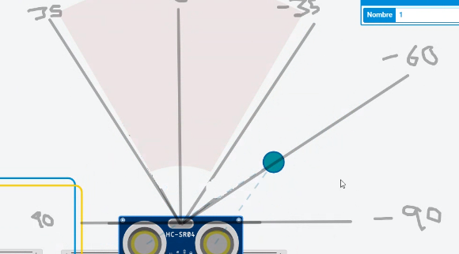

# :trophy: A.3.1 Learning activity

### :pencil2: Development

1. Use the following components for the elaboration of this activity.

    | Quantity | Description                                                                                                                                                                                                                        |
    | -------- | ---------------------------------------------------------------------------------------------------------------------------------------------------------------------------------------------------------------------------------- |
    | 1        | [Ultrasonic sensor HC-SR04](https://www.amazon.com.mx/SainSmart-HC-SR04-Ranging-Detector-Distance/dp/B004U8TOE6/ref=sr_1_5?__mk_es_MX=%C3%85M%C3%85%C5%BD%C3%95%C3%91&dchild=1&keywords=hc-sr04&qid=1599005012&sr=8-5)             |
    | 1        | [16x2 Display LCD](https://www.sparkfun.com/datasheets/LCD/ADM1602K-NSW-FBS-3.3v.pdf)                                                                                                                                              |
    | 1        | [5V Power supply](https://naylampmechatronics.com/fuentes-switching/830-fuente-de-alimentacion-dc-5v-1a.html)                                                                                                                      |
    | 1        | [1 Potentiometer 10k ](https://www.amazon.com.mx/Uxcell-a15011600ux0235-Linear-Rotary-Potentiometer/dp/B01DKCUVMQ/ref=sr_1_1?__mk_es_MX=%C3%85M%C3%85%C5%BD%C3%95%C3%91&dchild=1&keywords=potenciometro+10k&qid=1599005041&sr=8-1) |
    | 1        | [Arduino UNO](https://www.amazon.com.mx/Progressive-Automations-LC-066-Arduino-Rev3/dp/B00WH5XOJK/ref=sr_1_7?__mk_es_MX=%C3%85M%C3%85%C5%BD%C3%95%C3%91&dchild=1&keywords=arduino+uno&qid=1599005073&sr=8-7)                       |  |

2. Based on the following picture, assemble the circuit shown in the simulator using **Figure 1**.

    <p align="center"> 
        <strong>Figure 1 Ultrasonic Sensor</strong><br>
        
    </p>


3. Create a program that via the arduino's pins, receives the values registered by the **Ultrasonic sensor** when an object is at different distances.

    <p align="center">
        
    </p>

4. Considering that the ultrasonic sensor has a minimum and maximum detection range based on the sonic signal's return time, what values are obtained under the **following conditions:**

    | No. | Condition 1            | Condition 2                      | Is the object detected? |
    | --- | ---------------------- | -------------------------------- | ----------------------- |
    | 1   | 5 cm from the sensor   | 0° from its perpendicular axis   | YES                     |
    | 2   | 50 cm from the sensor  | 35° from its perpendicular axis  | YES                     |
    | 3   | 100 cm from the sensor | -35° from its perpendicular axis | YES                     |
    | 4   | 5 cm from the sensor   | 90° from its perpendicular axis  | NO                      |
    | 5   | 50 cm from the sensor  | -60° from its perpendicular axis | NO                      |
    | 6   | 350 cm from the sensor | 0° from its perpendicular axis   | NO                      |

5. Once the previous points have been completed, add to the Figure 1, **An 16x2 I2C LCD Display**, and add a picture of the completed circuit.

    <p align="center">
        
    </p>

6. After the LCD Display, adjust the program so that it displays the following message **"Target detected at ? cm"**, and when its not detected, it displays **"Target out of range"**.

    <p align="center">
        
        
    </p>


7. Place here picture evidence that can be considered important during the activity's development.

    <p align="center">
        
        
        
        
        
        
        
    </p>

8.  Insert picture **evidence**  from the team meetings while developing the activity.

    <p align="center">
        
    </p>

### Los grumosos 🐻 Conclusions.
##### Nava Reyes Carlos 
```
In this practice different tests were carried out on the HC-SR04 sensor which allows to measure the distance of an object by ultrasonic waves, the most difficult part of this practice was to configure the LCD because tinkercad does not provide an I2C for connection, however with the help of an example provided by Tinkercad was simpler, the HC-SR04 has a detection angle of 90 degrees which allows to obtain very interesting results
```
##### Olivas Calderon Cinthia Guadalupe
```
In this practice, what we made was a circuit where we integrated an HC-SR04 ultrasonic sensor and an LCD screen. To develop the circuit, the Tinkercad platform provides us with an example of a circuit with an LCD screen that we used to view the results of the distance detected by the sensor. To assemble the sensor we were investigating which pins it had to be connected to and thus we were able to obtain a correct operation, with the help of the code we were able to calculate the distance and it is also shown if the object is out of range.
```
##### Ontiveros Lara Claudia Sarahi
```
In this practice we made a circuit that worked as an object meter using Arduino, an ultrasonic sensor (HC-SR04) and an LCD display that we configured to be I2C, using a resistor and a potentiometer to regulate the contrast and backlight of the screen. The first stage was to assemble the part of the object detector sensor, where we could see in the simulator the operation of the ultrasonic sensor. The second part consisted of the integration of the display with I2C connection, in addition to the implementation of code that allowed us to indicate by means of the screen if the object was outside the range or not, and at what distance.
```
##### Valdés Fuchs Agustín  
```
When making this activity I was able to see the behavior of the ultrasonic sensor, as well as its range of operations given different distances and angles, I also learnt the way an LCD Display is used alongside the micro controller. The main issue we found was that the displayed value did not match the distance of the object, we later resolved it by researching code examples made by other people.
```
___

### :octopus: Github links

##### :church: [Carlos Nava](https://github.com/CarlosNavaR/SistemasProgramables)
##### :princess: [Cinthia Olivas](https://github.com/OlivasCinthia/Sistemas-programables.git)
##### :octocat: [Claudia Ontiveros](https://github.com/OntiverosClaudia/SistemasProgramables.git)
##### :alien: [Agustin Valdés](https://github.com/dasgrossfuchs/SistemasProgramables)

