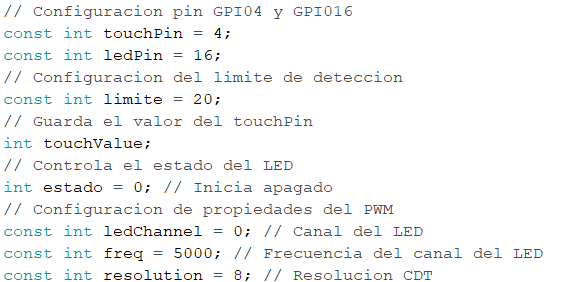
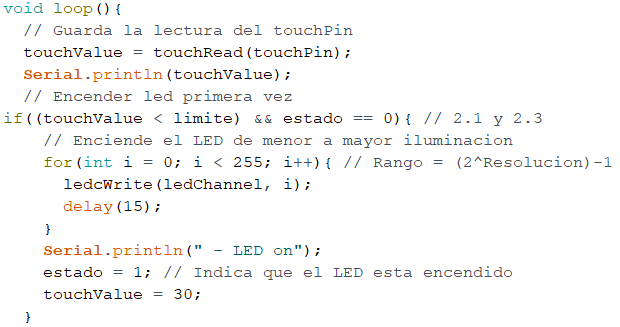
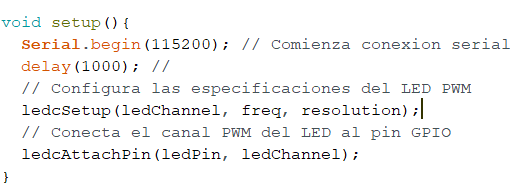
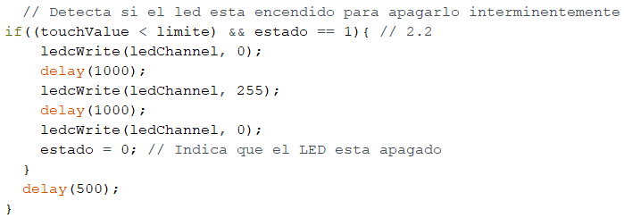
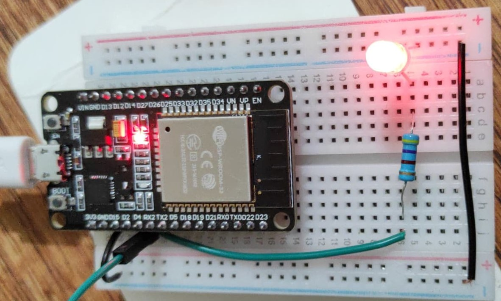
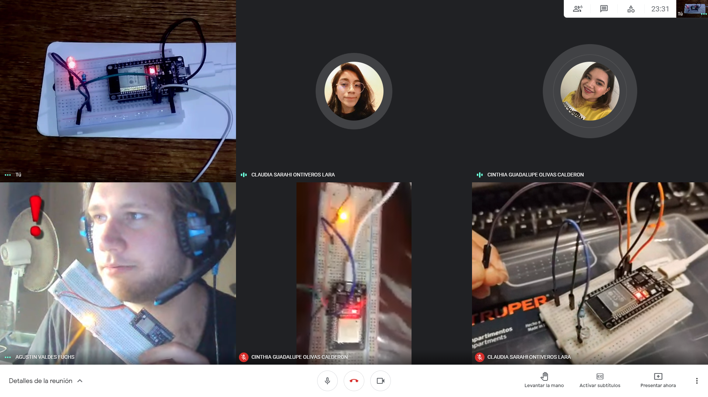

# :trophy: A.3.2 Learning activity

Tact sensor circuit by a NodeMCU ESP32

---

### Complimentary sources for developing the activity

- [x] [Capacitive Touch Sensor](https://randomnerdtutorials.com/esp32-touch-pins-arduino-ide/)
- [x] [Analog Output PWM](https://randomnerdtutorials.com/esp32-pwm-arduino-ide/)

---

## Development

1. Use the following list of materials for the activity's development

| Quantity | Description                                                                                                                                                                                                                |
| -------- | -------------------------------------------------------------------------------------------------------------------------------------------------------------------------------------------------------------------------- |
| 1        | Red LED diode                                                                                                                                                                                                              |
| 1        | 330 ohms Resistor                                                                                                                                                                                                          |
| 1        | 5V Power supply                                                                                                                                                                                                            |
| 1        | [NodeMCU ESP32](https://www.amazon.com.mx/ESP-32-ESP-32S-ESP-WROOM-32-ESP32-S-desarrollo/dp/B07TBFC75Z/ref=sr_1_2?__mk_es_MX=%C3%85M%C3%85%C5%BD%C3%95%C3%91&dchild=1&keywords=esp32&qid=1599003438&sr=8-2)                |
| 1        | [BreadBoard](https://www.amazon.com.mx/Deke-Home-Breadboard-distribuci%C3%B3n-electr%C3%B3nica/dp/B086C9HK7V/ref=sr_1_22?__mk_es_MX=%C3%85M%C3%85%C5%BD%C3%95%C3%91&dchild=1&keywords=breadboard&qid=1599003455&sr=8-22)   |
| 1        | [Jumpers M/M](https://www.amazon.com.mx/ELEGOO-Macho-Hembra-Macho-Macho-Hembra-Hembra-Protoboard/dp/B06ZXSQ5WG/ref=sr_1_1?__mk_es_MX=%C3%85M%C3%85%C5%BD%C3%95%C3%91&dchild=1&keywords=jumper+wires&qid=1599003519&sr=8-1) |
| 1        | Aluminum foil                                                                                                                                                                                                              |

<p align="center"> 

</p>

2. Once the previously shown circuit is assembled, create the code needed for the hardware complies with the following conditions:

   - The sistem should be able to turn ON and OFF **an LED** when interacting with the touch sensor.
   - The system should start a 3 second long sequence (in which it turns OFF 1 second, then ON 1 second, then OFF), if the sensor is touched while the LED is turned ON.
   - The system should gradually increase the LED's brightness until it reaches its maximum state, if the sensor is touched while de LED is turned OFF.

3. Insert important evidence during the activity's development, with pictures, such as reunions.

<p>
<table>
<tr><td></td>
<td></td></tr>
<tr><td></td>
<td></td></tr>
</table>
<div align="center">
</p>
</div>

4. Insert picture **evidence** from the team meetings while developing the activity.



---

### Los grumosos 🐻 Conclusions.

##### Nava Reyes Carlos

```
In this practice an LED was used and as controller an ESP32, were put into practice elements that we had previously used as is the concept of the PWM, with the help of certain special features that this controller has as are touch-sensitive pins, due to these features an LED can be turned on and off by touching a cable, Thanks to these features of the controller we can perform the practice correctly.
```

##### Olivas Calderon Cinthia Guadalupe

```
To carry out this practice, we had to make a circuit in which an LED was lit by touch but with different conditions, for example that it could be turned on and off, had a 3-second flashing sequence, and the LED would light up for a short time. little by little until reaching its maximum level. To achieve this we did it through code in the Arduino IDE and we were placing different instructions, from what I could tell is that sometimes the cable was not touched and the Led turned on by itself. Investigating we were able to do the activity correctly.
```

##### Ontiveros Lara Claudia Sarahi

```
In carrying out this practice we used the ESP32 and a program called Arduino IDE to turn on an LED when touching a jumper, in addition to modifying the code used to achieve some requirements that we requested, such as modifying the LED lighting or varying its status. It was an interesting practice, because we used physical components.
```

##### Valdés Fuchs Agustín

```
In this practice we used the ESP32, along with an LED, which when using the TOUCH sensitive pins as a sensor, came up with a circuit capable of simulating a touch lamp, along with code designed to be used for PWM functions which allow the LED to power up gradually.
```

---

### :octopus: Github links

##### :church: [Carlos Nava](https://github.com/CarlosNavaR/SistemasProgramables)

##### :princess: [Cinthia Olivas](https://github.com/OlivasCinthia/Sistemas-programables.git)

##### :octocat: [Claudia Ontiveros](https://github.com/OntiverosClaudia/SistemasProgramables.git)

##### :alien: [Agustin Valdés](https://github.com/dasgrossfuchs/SistemasProgramables)
