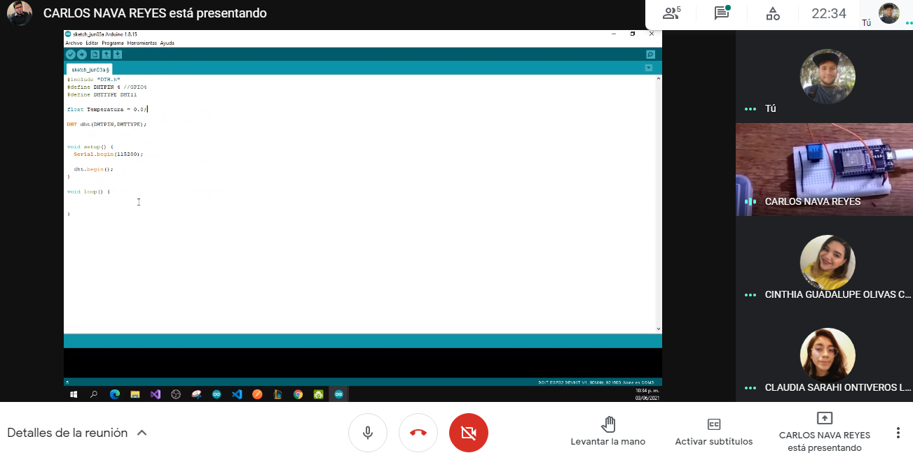
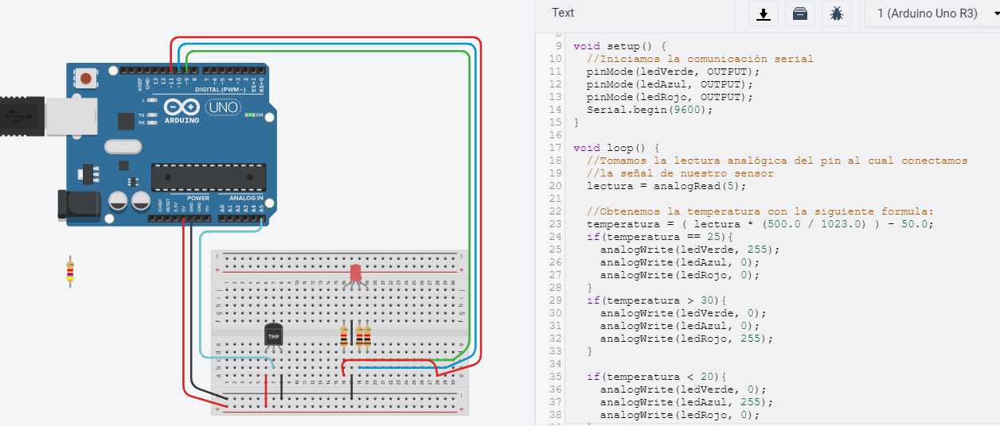
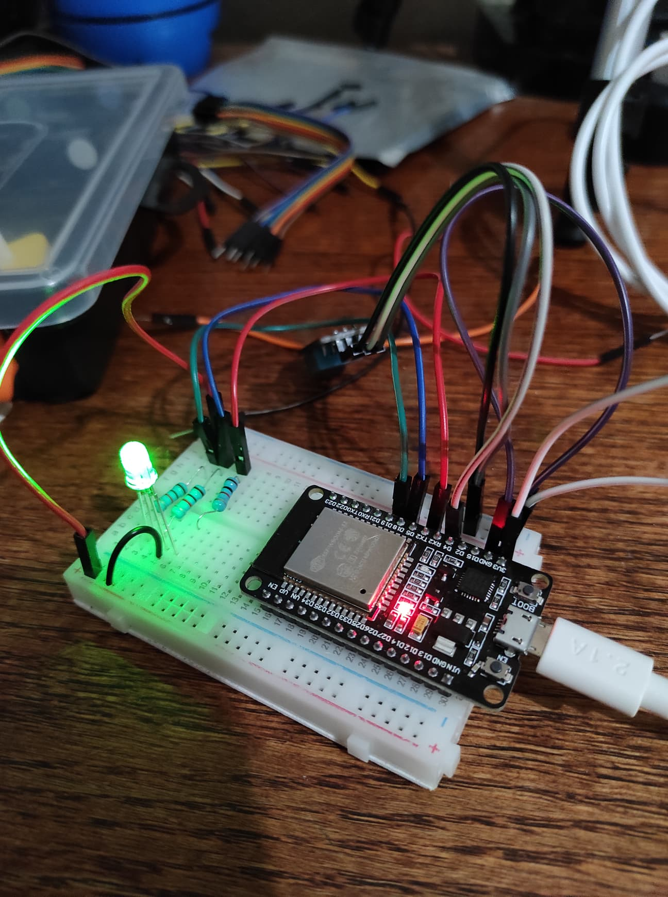
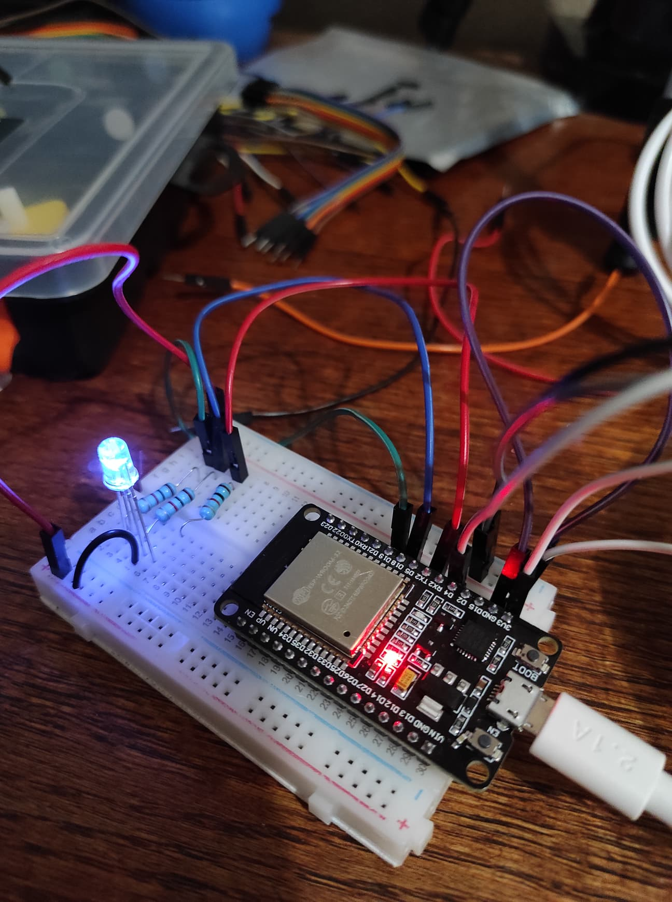
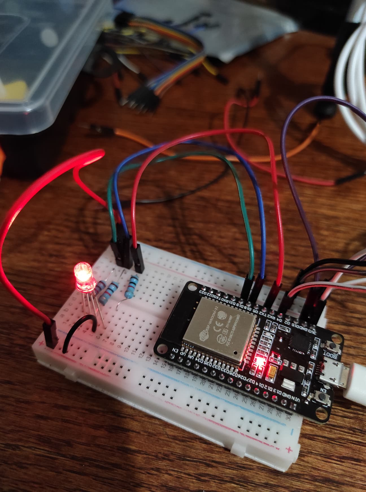
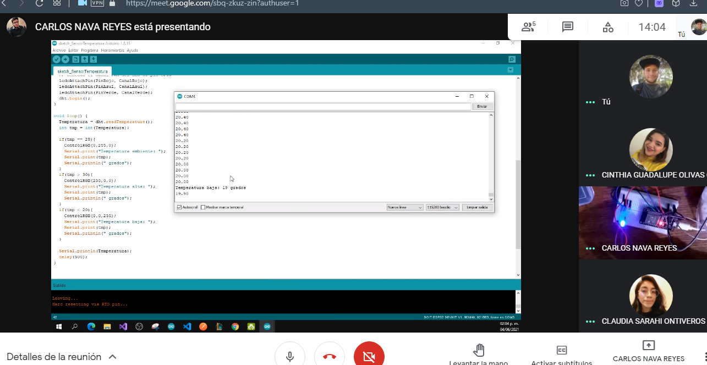

# :trophy: A.3.3 Learning activity

## Development

1. Use the following materials for the activity's development.

   | Quantity | Description                                                                                                                                                                                                                              |
   | -------- | ---------------------------------------------------------------------------------------------------------------------------------------------------------------------------------------------------------------------------------------- |
   | 1        | [Temperature and humidity sensor DHT11](https://articulo.mercadolibre.com.mx/MLM-664315278-sensor-de-temperatura-y-humedad-dht11-cjumpers-arduino-pic-_JM#position=1&type=item&tracking_id=b203e8cd-c375-429a-9b75-8c57e8b35386) o DHT22 |
   | 1        | RGB LED Diode                                                                                                                                                                                                                            |
   | 1        | 4.7 kohms Resistance                                                                                                                                                                                                                     |
   | 3        | 1 kohm Resistance                                                                                                                                                                                                                        |
   | 1        | 5V Power source                                                                                                                                                                                                                          |
   | 1        | [NodeMCU ESP32](https://articulo.mercadolibre.com.mx/MLM-587686290-esp32-wifi-bluetooth-42-ble-nodemcu-esp8266-libro-gratis-_JM#position=1&type=item&tracking_id=84a6234b-5016-47eb-9950-39b49846ca72)                                   |
   | 1        | BreadBoard                                                                                                                                                                                                                               |
   | 1        | Jumpers M/M                                                                                                                                                                                                                              |

2. Based on the shown picture, assemble the circuit so that it follows the instructions shown bellow.

<p align="center"> 

</p>

3. Once assembled add an RGB LED, and create the code necessary for the LED to act as an indicator for the following conditions:

   - The temperature sensor must be sensing, sending the registered value to the serial channel, for example "Regular temperature: 25 Degrees", and the **RGB LED** turns ON to GREEN.
   - If the registered temperature goes 20% over the Regular temperature , sending the registered value to the serial channel, for example "High temperature: **_?_** Degrees ", and the **RGB LED** turns ON to RED.
   - If the registered temperature goes 20% under the Regular temperature , sending the registered value to the serial channel, for example "LOW temperature: **_?_** Degrees ", and the **RGB LED** turns ON to BLUE.

4. Insert important evidence during the activity's development, with pictures, such as reunions.

<p align="center">



</p>

5. Insert picture **evidence** from the team meetings while developing the activity.
<p align="center">

</p>

---

### Los grumosos 🐻 Conclusions.

##### Nava Reyes Carlos

```
This practice consisted of a temperature sensor and an LED diode to express the current temperature in different colors represented certain temperature, the most difficult thing of this practice was to configure the LED because this had the characteristic of being common anode which its default state is to be on, it was required to do extra operations to determine the state of this same, The practice was simulated in TinkerCad for greater understanding regardless of whether they were different components than required.
```

##### Olivas Calderon Cinthia Guadalupe

```
The purpose of this practice was to create a circuit where it would allow us to capture the temperature with the help of an ESP32 and a DHT11 sensor. To be able to realize the change in temperature, an RGB LED diode was used as well as it was encoded in Arduino IDE to show us a message and depending on the temperature it would show us the 3 colors.
In order for it to work properly we had to investigate and do simulations with the help of TinkerCad, once we did it we also investigated how we had to connect the pins to the ESP32 and something we had to pay more attention to was the configuration of the LED because it has the characteristic of being a common anode.
```

##### Ontiveros Lara Claudia Sarahi

```
This practice consisted in using the temperature sensor DHT11 in conjunction with an rgb led diode, in such a way that when the temperature was considered normal or ambient the led turned on green, when it was above that value the LED turned on red and when it was below the normal temperature it turned on blue. On this occasion we could not all do this practice, since the main component was team and only one member had it, so we first did a simulation in Tinkercad.
```

##### Valdés Fuchs Agustín

```
The objective of this practice was to make a circuit capable of a digital output based on a value given by a sensor, then using code deciding wether it was hotter or colder than an ambient temperature given, this was then sent to display by an RGB LED. We had some issues with the colors as they wouldn't display correctly, we later solved it when we fixed the code to fit the properties of the RGB LED. We also used TinkerCad to simulate a similar circuit using different components to visualize the expected results beforehand.
```

---

### :octopus: Github links

##### :church: [Carlos Nava](https://github.com/CarlosNavaR/SistemasProgramables)

##### :princess: [Cinthia Olivas](https://github.com/OlivasCinthia/Sistemas-programables.git)

##### :octocat: [Claudia Ontiveros](https://github.com/OntiverosClaudia/SistemasProgramables.git)

##### :alien: [Agustin Valdés](https://github.com/dasgrossfuchs/SistemasProgramables)
