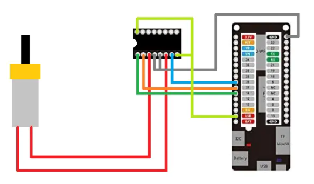
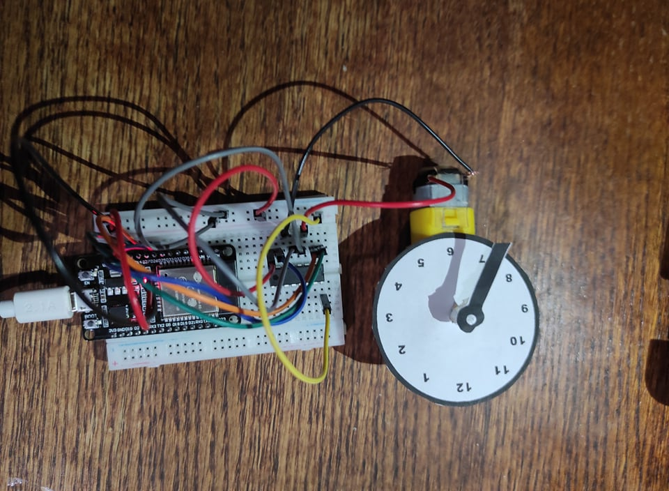
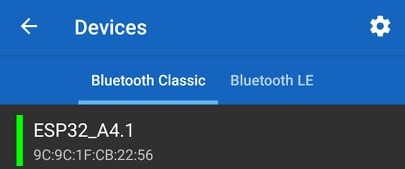
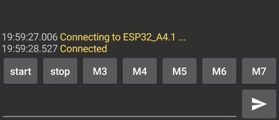
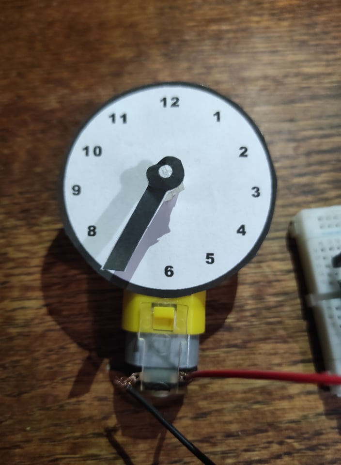
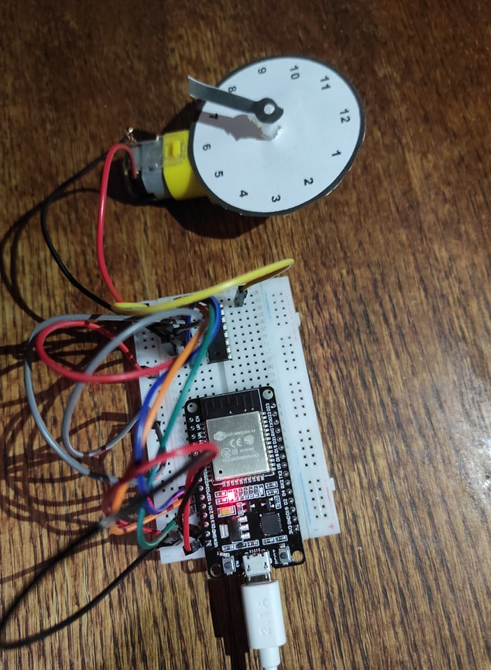
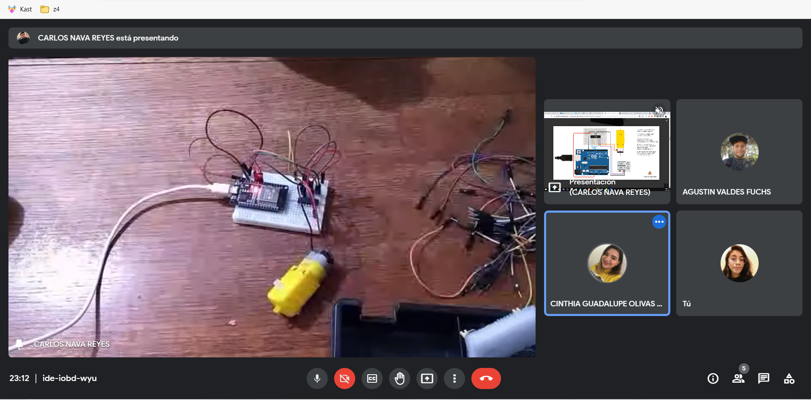

# :trophy: A4.1 Learning activity

## Development

1. Use the following materials for the activity's development.

  | Quantity | Description                                                                                                      |
  | -------- | ---------------------------------------------------------------------------------------------------------------- |
  | 1        | [IC L293D](https://www.amazon.com.mx/330ohms-M%C3%B3dulo-Sensor-Humedad-Temperatura/dp/B07Q4KWJQY/)              |
  | 1        | 5V power source                                                                                                  |
  | 1        | [NodeMCU ESP32](https://www.amazon.com.mx/ESP-32-ESP-32S-ESP-WROOM-32-ESP32-S-desarrollo/dp/B07TBFC75Z/)         |
  | 1        | [BreadBoard](https://www.amazon.com.mx/Deke-Home-Breadboard-distribuci%C3%B3n-electr%C3%B3nica/dp/B086C9HK7V/)   |
  | 1        | [Jumpers M/M](https://www.amazon.com.mx/ELEGOO-Macho-Hembra-Macho-Macho-Hembra-Hembra-Protoboard/dp/B06ZXSQ5WG/) |
  | 1        | Reduction Motor                                                                                                  |

2. Based on the pictures shown in the **Figure 1** assemble a circuit that is able to accomplish the following instructions:
   
  + Using the application "Serial Bluetooth terminal" that is available in the Google play store, or any other bluetooth interface available the starting and stopping of the DC Motor, which would be by creating two petitions, one of which represents a **"START" and the other the "STOP option"**.
  + The Motor should be able to rotate clockwise for 5 seconds, then stop for one second, and finally for 5 seconds counterclockwise, also the **STOP** petition should be able to be executed at any moment to stop the Motor, otherwise it wont stop at any moment.
    
  <p align="center"> 
  <strong>Figura 1 Circuito ESP32 IC L293 Motor DC</strong><br>
  
  </p>

3. Place here a picture of the assembled circuit.

  <p align="center"> 
  
  </p>

4. Place here the software created in the Arduino IDE.

  ```
  #include "BluetoothSerial.h" // Librería para conexión Bluetooth
  
  // Configuración de pines para usar L293D
  int EntradaMPin1 = 27; // Entrada 1
  int EntradaMPin2 = 26; // Entrada 2
  int PinEncendido = 14; // 1,2 En
  
  // Variables para controlar el tiempo
  unsigned long TiempoMillis; 
  unsigned long TiempoSegundos; 
  int TiempoMotor = 0;
  
  // Variables para controlar el monitor serialBT
  BluetoothSerial SerialBT; // Instancia de la librería
  String Instruccion = ""; // Almacenar instrucción de Serial Bluetooth
  boolean UnaInstruccion = false; // Para detectar el start
  int ControlarStart = 0; // Controla que solo detecte el primer start
  
  void setup() {
    Serial.begin(115200); // Inicia monitor serial
    SerialBT.begin("ESP32_A4.1"); // Inicia conexión Bluetooth
    Serial.println("Conectate a Bluetooth!");
  
  // Configuración de los pines como salida
    pinMode(EntradaMPin1, OUTPUT);
    pinMode(EntradaMPin2, OUTPUT);
    pinMode(PinEncendido, OUTPUT);
  }
  
  void loop() {
    TiempoMillis = millis(); // Guarda valor función Millis()
    if(TiempoMillis >= (TiempoSegundos + 1000)){ // Compara el tiempo actual con el próximo segundo
      TiempoSegundos = TiempoMillis; // Toma el valor actual
      Read(); // LLama a la función
      // Instrucciones para el comportamiento del motor
      if(Instruccion == "START" && UnaInstruccion == true){ // Activación de motor
        if(TiempoMotor < 5){ // Primeros 5 segundos
          Avanzar();
        }
        else if(TiempoMotor < 6){ // Pausa de un segundo
          Serial.print("Pausa: ");
          Stop();
        }
        else if(TiempoMotor < 11){ // Siguientes 5 segundos
          Reversa();
        }
        else if(TiempoMotor < 12){ // Pausa de un segundo
          Serial.print("Pausa: ");
          Stop();
        }
  
        Serial.println(TiempoMotor); 
        TiempoMotor += 1; //Incrementa tiempo de activación del motor
  
        if(TiempoMotor == 12){ 
          TiempoMotor = 0; // Reinicia el ciclo de motor (tiempo)
        }
        
      }else if(Instruccion == "STOP" && UnaInstruccion == false){ // Desactivación del motor
        TiempoMotor = 0;
        Stop();
      }
    }
  }
  
  // Función para leer en el Serial BT
  void Read(){ 
    if(SerialBT.available()) {
      Instruccion = (SerialBT.readString());
      Instruccion.trim(); // Elimina espacios en blanco
      // Verificacion para proteger que no se cicle al recibir mas de un start
      if(Instruccion == "START"){
        if(ControlarStart == 0){
          UnaInstruccion = true;
          ControlarStart = 1;
        }else if(ControlarStart == 1){
          ControlarStart = 0;
          UnaInstruccion = false;
          Instruccion = "STOP";
          Serial.println("Apagando...");
        }
      }else if(Instruccion == "STOP"){
      ControlarStart = 0;
      UnaInstruccion = false;
      }
      Serial.println(Instruccion);
    }
  }
  
  // Función para girar a las manecillas del reloj
  void Avanzar(){ 
    Serial.print("Derecha: ");
    digitalWrite(EntradaMPin1, HIGH);
    digitalWrite(EntradaMPin2, LOW);
    digitalWrite(PinEncendido, HIGH);
  }
  
  // Función para girar en contra de las manecillas del reloj
  void Reversa(){
    Serial.print("Izquierda: ");
    digitalWrite(EntradaMPin1, LOW);
    digitalWrite(EntradaMPin2, HIGH);
    digitalWrite(PinEncendido, HIGH);
  }
  
  // Función para desactivar el motor
  void Stop(){
    digitalWrite(PinEncendido, LOW); // Desactivación de 1,2 En
  }
  ```

5. Place here any important evidence.

  
  <p align="center">
  
  
  
  
  
  </p>

6. Insert picture **evidence** from the team meetings while developing the activity.

  <p align="center">
  
  </p>
___

### Los grumosos 🐻 Conclusions.
##### Nava Reyes Carlos 
```
This practice consists of a DC engine and a H bridge (L293D) that facilitates the control of the engine, during the practice we were presented with different problems, when trying to establish a connection with the bluetooth terminal and at the same time to make the engine perform a sequence, when using the delay function we realize that this function freezes the whole program leaving only the current instruction running, This problem was solved using the millis function instead of the delay function, once you managed to control the time everything was easier.
```
##### Olivas Calderon Cinthia Guadalupe
```
The practice consisted of making a circuit that had as main components a dc motor, ESP32 and an IC L293D. The first thing we did was a program in the Arduino IDE where we made the bluetooth connection between the ESP32 and Arduino, using an app, and we sent messages to verify that it worked. Since we did this, when we put the IC L293D, we began to have problems with the connections of this component and the ESP32, we also realized that we had errors in the code so we opted to look for functions with which we could achieve the objective of the practice that was by means of instructions by bluetooth the motor stopped or started a turning sequence.
```
##### Ontiveros Lara Claudia Sarahi
```
The practice was to use a DC engine, an H-bridge (L293D) to facilitate engine control and a NodeMCU ESP32 to use your bluetooth connection. The main purpose was to turn on and off the DC engine via the bluetooth connection, this was achieved using Arduino IDE and a mobile app called Serial Bluetooth Terminal, of course it had to meet certain features, the activation was cyclical by turning 5 seconds to the right, 5 seconds to the left, making a pause of one second between change of direction, plus it must stop immediately as soon as it is indicated. We had some difficulties when performing the practice, mainly because we did not know very well the components to use or when coding to meet the characteristics we were asked to.

```
##### Valdés Fuchs Agustín  
```
In this practice we had to make a circuit capable of controlling a motor with instructions given by us via a Bluetooth connection with our phones, or any other Bluetooth capable device. It was simple at first, we established the connection, then made sure Bluetooth connection carried over the message. Then, as not everyone in the team had the motor, some of us decided to test the functionality by using an RGB LED that would convey the operations with color states instead of movement, that alone gave us some issues when transferring the message to be used as a string since it had to be cleaned with the trim method before it could be compared, and although the method of implementation used in this test was not as efficient as the resulting code, it was useful for later on with the activity. Alongside the previous task, the teammate who did have the motor assembled the circuit and started testing basic instructions to make sure the circuit was assembled correctly, at first there were some issues with the function to make the motor move when used alongside the bluetooth serial reading function, so it was moved to a standalone function, then there was an issue with the timing and the fact it had to be able to be stopped or started at any time of its operation, so those two where also moved to different standalone functions, then a MILLIS function was implemented alongside other comparators, those then served as an alternative to the DELAY function, this was done in order for it to not have to stop, which would make the device's operational flow non continuous and therefore not able to receive and execute immediately the instruction given by bluetooth.
```
___

### :octopus: Github links

##### :church: [Carlos Nava](https://github.com/CarlosNavaR/SistemasProgramables)
##### :princess: [Cinthia Olivas](https://github.com/OlivasCinthia/Sistemas-programables.git)
##### :octocat: [Claudia Ontiveros](https://github.com/OntiverosClaudia/SistemasProgramables.git)
##### :alien: [Agustin Valdés](https://github.com/dasgrossfuchs/SistemasProgramables)

