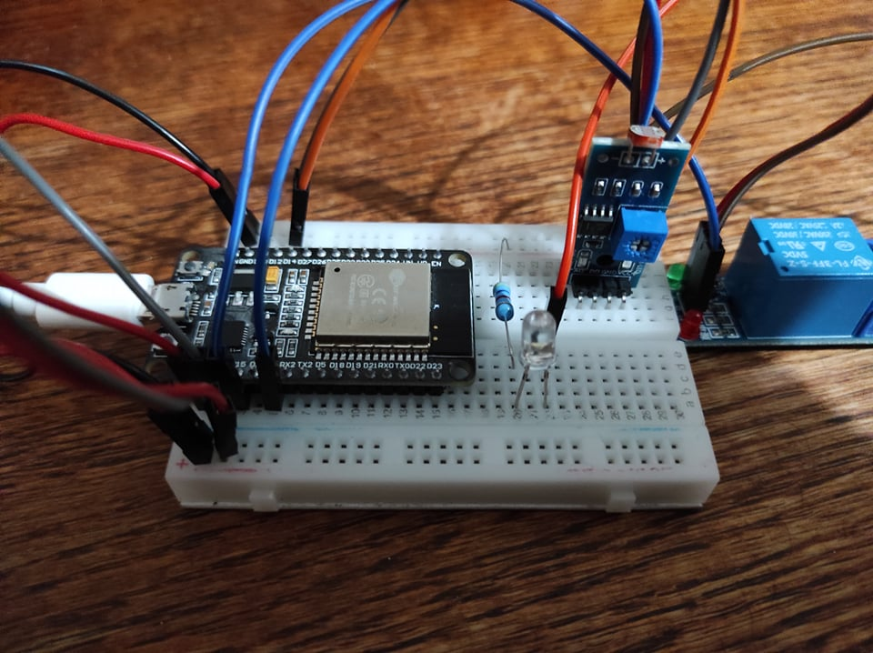
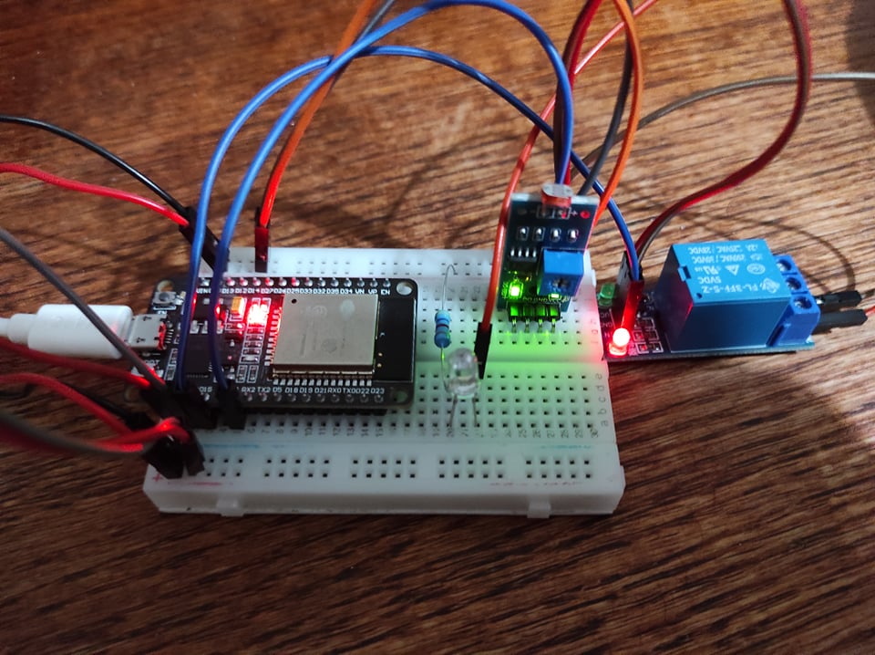
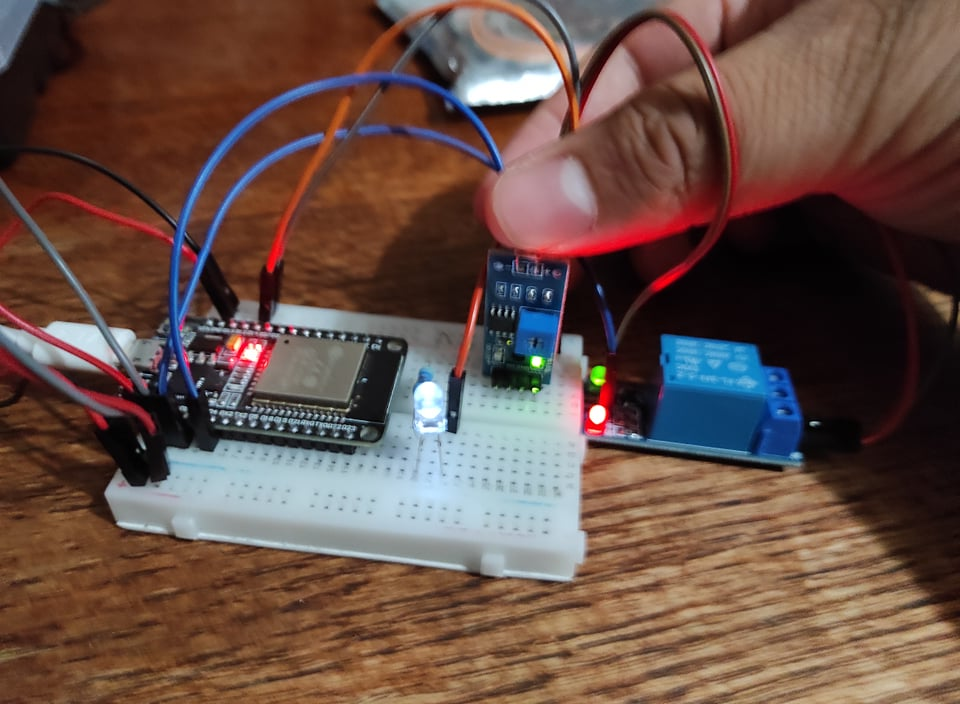
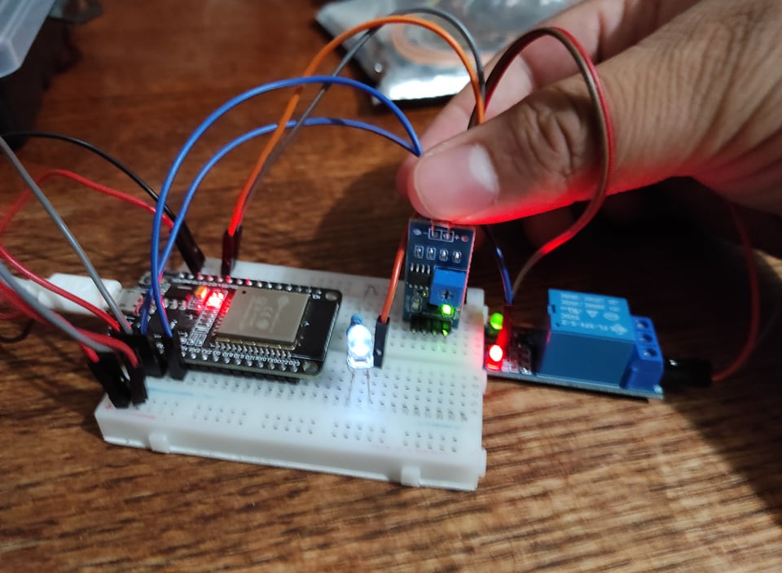
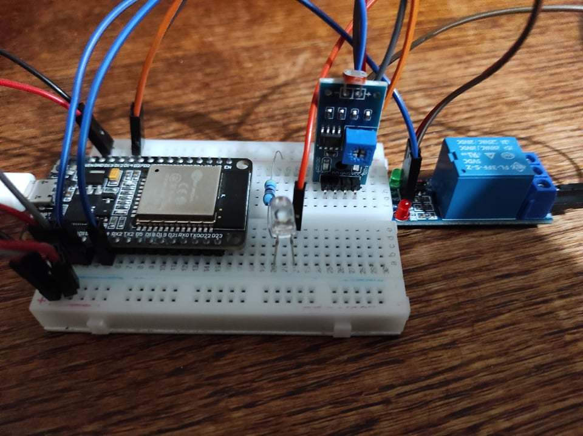
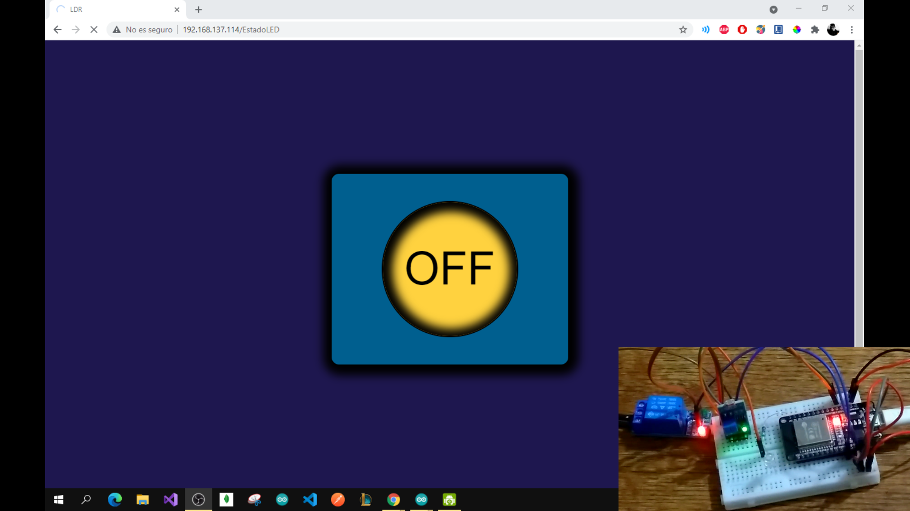
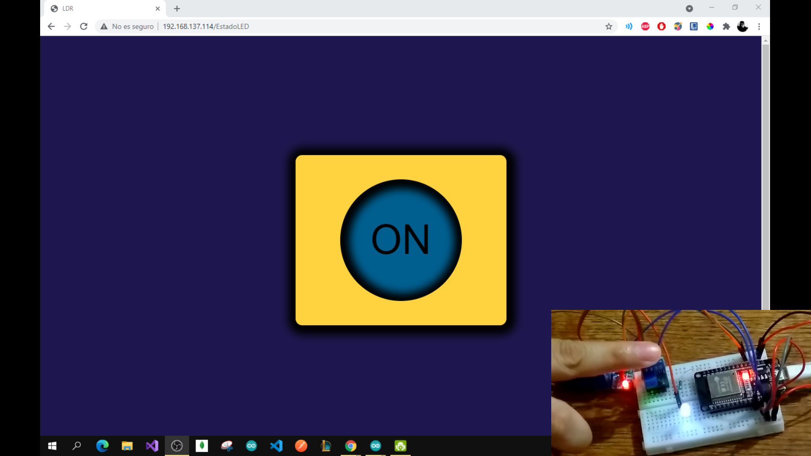
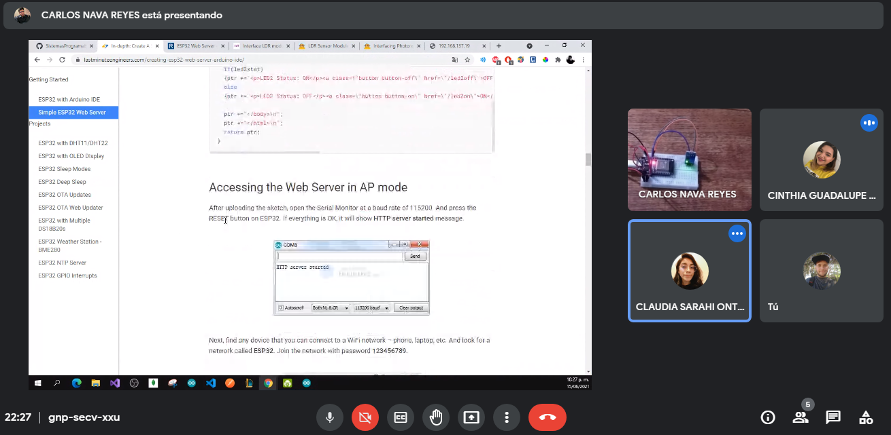

# :trophy: A4.2 Learning activity

## Development

1. Use the following materials for the activity's development.

| Quantity | Description                                                                                                                                                                                                                |
| -------- | -------------------------------------------------------------------------------------------------------------------------------------------------------------------------------------------------------------------------- |
| 1        | [LDR Sensor](https://articulo.mercadolibre.com.mx/MLM-623282168-modulo-sensor-de-luz-ldr-_JM)                                                                                                                              |
| 1        | Relay 3.3v                                                                                                                                                                                                                 |
| 1        | Light bulb                                                                                                                                                                                                                 |
| 1        | 5V power supply                                                                                                                                                                                                            |
| 1        | [NodeMCU ESP32](https://www.amazon.com.mx/ESP-32-ESP-32S-ESP-WROOM-32-ESP32-S-desarrollo/dp/B07TBFC75Z/ref=sr_1_2?__mk_es_MX=%C3%85M%C3%85%C5%BD%C3%95%C3%91&dchild=1&keywords=esp32&qid=1599003438&sr=8-2)                |
| 1        | [BreadBoard](https://www.amazon.com.mx/Deke-Home-Breadboard-distribuci%C3%B3n-electr%C3%B3nica/dp/B086C9HK7V/ref=sr_1_22?__mk_es_MX=%C3%85M%C3%85%C5%BD%C3%95%C3%91&dchild=1&keywords=breadboard&qid=1599003455&sr=8-22)   |
| 1        | [Jumpers M/M](https://www.amazon.com.mx/ELEGOO-Macho-Hembra-Macho-Macho-Hembra-Hembra-Protoboard/dp/B06ZXSQ5WG/ref=sr_1_1?__mk_es_MX=%C3%85M%C3%85%C5%BD%C3%95%C3%91&dchild=1&keywords=jumper+wires&qid=1599003519&sr=8-1) |

2. Based on the picture shown bellow, assemble a circuit and add a led, and a relay to one of the device's terminals, so that its able to accomplish the following instructions:
   - It should use the NodeMCU as a **standalone Web server**, so it provides a visual interface that it shows an image that represents its behaviour of 'ON or OFF' depending on the ambient lightning.
   - The sensor must measure the existing lightning.
   - When the sensor detects no light, the web interface should indicate an "ON" state, otherwise "OFF".
   - Add to the circuit a relay in serial connection with a bulb or led, which will be activated in oposite state of the shown web interface state of "ON" or "OFF", this means that with no light, the LED will turn on, otherwise off.

  <p align="center"> 
  <strong>Figure 1 Lightning measuring circuit with LDR and ESP32</strong>
  
  </p>

3. Place here the picture of the assembled circuit.

  <p align="center">
  
  </p>

4. Place here the code created in the Arduino IDE.

```
#include <WiFi.h> // Libreria para hacer conexion Wifi
#include <WebServer.h> // Libreria para crear servidor web

// Configuracion LDR
const int PinLDR = 4; // Pin digital que conecta el ESP32 y el LDR
unsigned int ValorLDR = 0; // Almacenar valor que capture el sensor

// Configuracion Wifi
const char* Red= "BLANK PROOF";
const char* Contrasenia= "buz1297.";

// Configuracion Relay
const int PinRelay = 15;

// Configuracion del puerto
WebServer server(80);

void setup() {
  Serial.begin(115200); // Inicia conexion serial
  pinMode(PinRelay, OUTPUT); // Se configura el pin del rele como salida

  WiFi.begin(Red, Contrasenia); // Comienza la conexion Wifi
  while (WiFi.status() != WL_CONNECTED) { // Comprueba si se realiza la conexion
    delay(1000);
    Serial.print(".");
  }
  Serial.println("");
  Serial.println("Ahora estas conectado a Wifi!");

// Establece la ruta y renderiza la pagina
  server.on("/EstadoLED", PaginaRuta);

  server.begin(); // Inicia el servidor
  Serial.print("Servidor iniciado en: ");
  Serial.println(WiFi.localIP());  // Muestra la direccion IP del dispositivo
  delay(100);
}

void loop() {
  ValorLDR = digitalRead(PinLDR); // Toma el estado del sensor
  server.handleClient(); // Escuchamos las conexiones entrantes
  ArchivoHTML();
  if(ValorLDR == 1) // Si hay ausencia de luz
    digitalWrite(PinRelay, LOW); // Enciende el led
  else
    digitalWrite(PinRelay, HIGH); // Apaga el led
}

// Funcion que define el tipo de archivo y carga el archivo HTML
void PaginaRuta() {
  server.send(200, "text/html", ArchivoHTML());
}

// Funcion que genera el archivo HTML en base al estado del sensor
String ArchivoHTML(){
  String contenido = "<!DOCTYPE html> <html>\n";
  contenido +="<head><meta name=\"viewport\" content=\"width=device-width, initial-scale=1.0, user-scalable=no\">\n";
  contenido +="<title>LDR</title>\n";
  contenido +="</head>\n";
  contenido +="<style>body {background-color: #1E174F;display: flex;align-items: center;justify-content: center;\n";
  contenido +="height: 100vh;}\n";
  contenido +=".d1 {background-color: #FFD23F;} .d2 {background-color: #005F8F;}\n";
  contenido +="div {padding: 3rem;width: 20rem;height: 15rem;border: 2px solid black;border-radius: 15px;display:\n";
  contenido +="flex;align-items: center;justify-content: center;box-shadow: 2px 2px 16px 15px #000000;}\n";
  contenido +=".d1 input {background-color: #005F8F;}\n";
  contenido +=".d2 input {background-color: #FFD23F;}\n";
  contenido +="input {font-size: 5rem;width: 15rem;height: 15rem;\n";
  contenido +="border-radius: 50%;box-shadow: inset 2px 2px 16px 15px #000000;border: 2px solid black;}</style>\n";
  contenido +="<body>\n";
  if(ValorLDR == 1)
    contenido +="<div class=\"d1\"><input type=\"button\" value=\"ON\"></div>\n";
  else
    contenido +="<div class=\"d2\"><input type=\"button\" value=\"OFF\"></div>\n";
  contenido +="</body>\n";
  contenido += "<script> setTimeout(() => { location.reload(); }, 1000); </script>\n";
  contenido +="</html>\n";
  return contenido;
}
```

5. Place here any important evidence.

  <p align="center">
  
  <br>
  
  <br>
  
  <br>
  </p>

6. Insert picture **evidence** from the team meetings while developing the activity.

  <p align="center">
  
  </p>
  
___

### Los grumosos 🐻 Conclusions.

##### Nava Reyes Carlos

```
In this practice the main objective was to make a server using the esp32 which would allow us to create a website that would show the state of an LDR sensor updating the information based on ambient light, the LDR sensor is the main component as it controls the behavior of the other elements, the conditions to be assessed using the LDR are when there is a lack of light with the help of a relay which activates an LED and when the environmental conditions are clear the LED turns off. The main problems that arose in this practice occurred at the time of making connections and realizing that we did not have enough power for a focus so we chose to use an LED.
```

##### Olivas Calderon Cinthia Guadalupe

```
In this practice what we did was a circuit that had to detect ambient light, but we also had to have a visual interface that showed the behavior of ON and OFF. The materials we used were the ESP32, an LDR sensor module, a relay, and we replaced the bulb with an LED. First we dedicated ourselves to make the circuit in the breadboard and encoded the WiFi connection to verify that if it worked for us, once realized this we placed the relay, and it was here where we began to have problems at the moment of wanting to connect a focus since it did not turn on, so we chose to place an LED. We also created the interface in HTML and decided that the server would restart every second depending on the state of the sensor, since if the sensor detected absence of light in the interface it had to show ON and the relay had to be activated then the LED had to be turned on, in case of showing OFF the opposite happened with the led.
```

##### Ontiveros Lara Claudia Sarahi

```
The practice was to assemble a circuit that would basically measure ambient light through an LDR sensor, and display it on a server with the help of the ESP32’s Wi-Fi connection, so that it would be updated when the LDR sensor picked up a light shift in the environment. Once you had this base, the next thing was to integrate into the circuit a relay to control the power on and off of an LED, so that when there is no light the LED turns on, otherwise it turns off, in addition to the server showing us the status of the LED, as it is updated every second to show any changes to the lighting. There were some problems with the integration of the relay and the LED since at the beginning it was not working and they looked for a way to change it for a focus, but finally they chose to use the LED and everything worked correctly.
```

##### Valdés Fuchs Agustín

```
In this practice we had to assemble a circuit capable of turning on or off an LED  depending on the light captured by an LDR sensor, by sending its outputting signal then using the signal via a relay to power allow voltage to reach the LED diode, the micro controller to manage this was an ESP32 that also had to create a web Interface that would show the state of the LDR sensor's signal, this was done using a program created in the Arduino IDE, that depending on the signal received would display a different version of the page. The first problem we faced was the changed state of the web interface, since we had to make it show that it had changed, this was solved within the html itself. The main problem we faced during this practice was on the circuit itself since we couldn't integrate the relay correctly.
```

---

### :octopus: Github links

##### :church: [Carlos Nava](https://github.com/CarlosNavaR/SistemasProgramables)

##### :princess: [Cinthia Olivas](https://github.com/OlivasCinthia/Sistemas-programables.git)

##### :octocat: [Claudia Ontiveros](https://github.com/OntiverosClaudia/SistemasProgramables.git)

##### :alien: [Agustin Valdés](https://github.com/dasgrossfuchs/SistemasProgramables)
