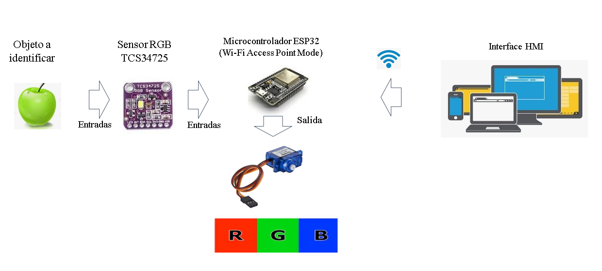

# :trophy: A5.1 Learning activity

## Development

1. Use the following materials for the activity's development.

  | Quantity | Description                                                                                                                                                                                                                |
  | -------- | -------------------------------------------------------------------------------------------------------------------------------------------------------------------------------------------------------------------------- |
  | 1        | RGB Sensor TCS34725                                                                                                                                                                                                        |
  | 1        | Servomotor SG90                                                                                                                                                                                                            |
  | 1        | 5v Power supply                                                                                                                                                                                                            |
  | 1        | [NodeMCU ESP32](https://www.amazon.com.mx/ESP-32-ESP-32S-ESP-WROOM-32-ESP32-S-desarrollo/dp/B07TBFC75Z/ref=sr_1_2?__mk_es_MX=%C3%85M%C3%85%C5%BD%C3%95%C3%91&dchild=1&keywords=esp32&qid=1599003438&sr=8-2)                |
  | 1        | [BreadBoard](https://www.amazon.com.mx/Deke-Home-Breadboard-distribuci%C3%B3n-electr%C3%B3nica/dp/B086C9HK7V/ref=sr_1_22?__mk_es_MX=%C3%85M%C3%85%C5%BD%C3%95%C3%91&dchild=1&keywords=breadboard&qid=1599003455&sr=8-22)   |
  | 1        | [Jumpers M/M](https://www.amazon.com.mx/ELEGOO-Macho-Hembra-Macho-Macho-Hembra-Hembra-Protoboard/dp/B06ZXSQ5WG/ref=sr_1_1?__mk_es_MX=%C3%85M%C3%85%C5%BD%C3%95%C3%91&dchild=1&keywords=jumper+wires&qid=1599003519&sr=8-1) |

2. Based on the picture shown bellow, assemble a circuit that is able to accomplish the following instructions:
    - The fist stage consists on, when placing an object in front of the sensor, it must be able to identify its color, and show in a visual interface the detected color.
    - The second stage will consist on adding an actuator that with the help of a color strip will point in the direction of the color detected by the sensor.

    
  <p align="center"> 
  <strong>Figure 1 ESP32 Color Sensor and servomotor circuit</strong><br>
    
  </p>

3. Place here the picture of the assembled circuit.

  <p align="center"> 
  <strong>Assembled Circuit</strong><br>
    
  </p>
  

4. Place here the code created in the Arduino IDE.

```
// Librerias para sensor RGB
#include <Wire.h>
#include "Adafruit_TCS34725.h"
#include "ColorConverterLib.h"
 
//Librerias para servidor web
#include <WebSocketsServer.h>
#include <ESP8266WiFi.h>
#include <ESP8266WebServer.h>
#include <FS.h>
 
// Libreria para el motor
#include <Servo.h>
 
Adafruit_TCS34725 Sensor = Adafruit_TCS34725(TCS34725_INTEGRATIONTIME_50MS, TCS34725_GAIN_4X); // Instancia del sensor RGB
WebSocketsServer webSocket = WebSocketsServer(81); // Instancia del WebSocket y puerto
 
Servo servo; // Instancia del motor
 
// Configuracion Wifi
const char* Red = "BLANK PROOF";
const char* Contrasenia = "buz1297.";
 
ESP8266WebServer server(80); // Define el puerto del server
 
void setup() {
  Serial.begin(115200); // Inicia conexion serial
 
  // Inicializa el sensor RGB
  if (Sensor.begin()) {
    Serial.println("Sensor encontrado");
  } else {
    Serial.println("No se encuentra el sensor");
    while (1);
  }
 
  WiFi.begin(Red, Contrasenia); // Comienza la conexion Wifi
  // Comprueba si se realiza la conexion
  while (WiFi.status() != WL_CONNECTED) {
    delay(1000);
    Serial.print(".");
  }
  Serial.println("");
  Serial.println("Ahora estas conectado a Wifi!");
 
  // Comienza el sistema de archivos
  if (!SPIFFS.begin()) {
    Serial.println("Error al conectar con el sistema de archivos");
    return;
  }
 // Establece ruta del servidor
  server.serveStatic("/", SPIFFS, "/Index.html"); // (Ruta, Sistema de archivos, Archivo)
 
  server.begin(); // Inicia el servidor
  Serial.print("Servidor iniciado en: ");
  Serial.println(WiFi.localIP());  // Muestra la direccion IP del dispositivo
 
  webSocket.begin(); // Inicia el Socket
  servo.attach(14); //D5
  servo.write(0); // Posicion 0
}
 
void loop() {
  webSocket.loop(); // Garantiza su ejecucion repetitiva
  server.handleClient(); // Escucha al cliente
  
  uint16_t rojo, verde, azul, clear; // Número entero sin signo de 2 bytes
  Sensor.getRawData(&rojo, &verde, &azul, &clear); // Obtiene los datos de los colores
  Serial.println("---- VARIABLES TOMADAS DEL GET RAW DATA ----");
  Serial.print("R: ");
  Serial.println(rojo);
  Serial.print("G: ");
  Serial.println(verde);
  Serial.print("B: ");
  Serial.println(azul);
  Serial.print("C: ");
  Serial.println(clear);
 
  
  uint32_t sum = clear;
  float r, g, b;
  // Hacer rgb medición aproximada
  r = rojo; r /= sum;
  g = verde; g /= sum;
  b = azul; b /= sum;
 
  // Transformar rgb a bytes
  r *= 256; g *= 256; b *= 256;
  
  Serial.println("---- VARIABLES TOMADAS DESPUES DE OPERACIONES ----");
  Serial.print("R: ");
  Serial.println(r);
  Serial.print("G: ");
  Serial.println(g);
  Serial.print("B: ");
  Serial.println(b);
  Serial.print("C: ");
  Serial.println(sum);
 
  
  // Convertir a hue, saturation, value
  double hue, saturacion, valor;
  ColorConverter::RgbToHsv(static_cast<uint8_t>(r), static_cast<uint8_t>(g), static_cast<uint8_t>(b), hue, saturacion, valor);
  hue = hue * 360;
  Serial.println("---- VARIABLES CONVERTIDAS EN HSV ----");
  Serial.print("Hue: ");
  Serial.println(hue);
  Serial.print("Saturacion: ");
  Serial.println(saturacion);
  Serial.print("Valor: ");
  Serial.println(valor);
  
  // Comprobacion de los colores
  if (hue < 15 ) {
    servo.write(180);
    Serial.println("Rojo");
    webSocket.broadcastTXT("Rojo"); // Transmision de datos al server
  } else if (hue > 89 && hue < 140) {
    servo.write(90);
    Serial.println("Verde");
    webSocket.broadcastTXT("Verde");
  } else if (hue > 190 && hue < 251) {
    servo.write(0);
    Serial.println("Azul");
    webSocket.broadcastTXT("Azul");
  } else {
    servo.write(45);
    Serial.println("Otro");
    webSocket.broadcastTXT("Otro");
  }
  delay(1000);
}
```

5. Place here any important evidence.

  <p align="center"> 
  <table align="center">
  <tr align="center"><td><strong>Case : Red detected</strong></td><td><strong>Case : Green detected</strong></td></tr>
  <tr align="center"><td></td>
  <td></td></tr>
  <tr align="center"><td colspan=2><strong>Case : Blue detected</strong></td></tr>
  <tr align="center"><td colspan=2></td></tr>
  </table>
  </p>
  <p align="center"> 
  <table align="center">
  <tr align="center"><td><strong>Case : Red detected</strong></td><td><strong>Case : Green detected</strong></td></tr>
  <tr align="center"><td></td>
  <td></td></tr>
  <tr align="center"><td colspan=2><strong>Case : Blue detected</strong></td></tr>
  <tr align="center"><td colspan=2></td></tr>
  </table>
  </p>

6. Insert picture **evidence** from the team meetings while developing the activity.

  <p align="center">
  
  </p>

7. For the demonstration at least one object must be used so that its able to cover three colors.


___


### Los grumosos 🐻 Conclusions.
##### Nava Reyes Carlos 
```
In this practice a circuit was made that allowed the detection of the colors of an object, Once the sample was taken by means of a web page, the captured color of the object would be shown, as well as with the help of a servo motor which would position itself in a box with the color, making the practice more interactive and dynamic. It was made with a sg90 servo motor, esp8266 and the main component was a tcs34725.

We had difficulties when integrating the different components into the same circuit by not knowing the physical characteristics of each, as well as their voltages and working modes, Among the problems that were presented is the desire to work the samples in real time without updating the page, was solved with the help of WebSockets which allowed us to create a communication point to point.
```
##### Olivas Calderon Cinthia Guadalupe
```
The practice was to make a circuit for identification of RGB colors, using as materials a sensor RGB TCS34725, a nodeMCU ESP32, a servomotor SG90, and apart we use a visual interface. 
For encoding on Arduino IDE, we use different libraries like  "Adafruit_TCS34725.h" and "ColorConverterLib. h" which we used to capture sensor values and convert them to HSV. For the visual interface we used HTML and WebServer that helped us to update the page. 
We had to investigate the conversion from RGB to HSV, as operations have to be performed to obtain more accurate values. 
For the servomotor we coded it taking into account the rotation it has which is 180°  and rotated depending on the color range in which it was.
We had difficulty not knowing well the characteristics of the components, but when we realized the errors generated we were able to perform the practice correctly.
```
##### Ontiveros Lara Claudia Sarahi
```
This practice consists of using a TCS34725 RGB sensor to recognize colors (in this case, red, green, blue and white), basically the operation is that when approaching an object of a color the RGB sensor detects it, the servomotor moves indicating which color detects the sensor and raise a server to reaffirm the detected color. Initially it was somewhat conflicting the realization of this practice, because circumstances do not help to work so well in team, so only one member could assemble it, one of the main problems was the issue that had to weld the sensor RGB, Another big problem was when the ESP32 burned and when it was believed that the other components as well.
For the implementation of the graphical interface a socket was used to update the sensor sample without needing to restart the server. A library was also used to make a color conversion from RGB to HSV, so as not to have so limited the range of color recognition.
```
##### Valdés Fuchs Agustín  
```
For this practice we had to create a circuit capable of displaying information of a color detected by an RGB sensor, the information had to be displayed or conveyed in two separate ways, first, a web server with a visual interface had to display the color detected, and second, using a motor we had to point to the color detected. 
The first issues we had were with the sensor, asi it wasn't getting the correct colors, we experimented and ended up using a different color format which is HSV this allowed us to only focus on one of the values and create ranges based on it. There were also some issues with the lightning of the room the circuit was in, as it acted as an interference when detecting the value.
The second issue we had was when adding the motor to the circuit, as most of the documentation showed the connection with arduino, we solved this by searching for the references of the equivalent pins for the ESP.
```
___

### :octopus: Github links

##### :church: [Carlos Nava](https://github.com/CarlosNavaR/SistemasProgramables)
##### :princess: [Cinthia Olivas](https://github.com/OlivasCinthia/Sistemas-programables.git)
##### :octocat: [Claudia Ontiveros](https://github.com/OntiverosClaudia/SistemasProgramables.git)
##### :alien: [Agustin Valdés](https://github.com/dasgrossfuchs/SistemasProgramables)

